# Cross-Mission Dual-Branch Multimodal Late-Fusion Architecture

This document formalizes the **Cross-Mission Dual-Branch Multimodal Late-Fusion Architecture** integrating NASA's LRO spatial context (via the **NASA-IBM Lunar Foundation Model ViT-B**) with ISRO's Chandrayaan-2 localized physical measurements (**DFSAR Polarimetry** and **IIRS Hyperspectral Absorption**).

---

## 1. Architectural Flowchart (Mermaid)

```mermaid
flowchart TD
    %% =========================================================================
    %% CROSS-MISSION DUAL-BRANCH MULTIMODAL LATE-FUSION ARCHITECTURE
    %% =========================================================================

    %% Styling & Theme Config
    classDef inputStyle fill:#0f172a,stroke:#38bdf8,stroke-width:2px,color:#f8fafc;
    classDef spatialStyle fill:#1e1b4b,stroke:#818cf8,stroke-width:2px,color:#f8fafc;
    classDef tabularStyle fill:#064e3b,stroke:#34d399,stroke-width:2px,color:#f8fafc;
    classDef fusionStyle fill:#431407,stroke:#fb923c,stroke-width:2px,color:#f8fafc;
    classDef outputStyle fill:#3b0764,stroke:#c084fc,stroke-width:2px,color:#f8fafc;
    classDef noteStyle fill:#1e293b,stroke:#64748b,stroke-dasharray: 4 4,stroke-width:1px,color:#cbd5e1;

    %% -------------------------------------------------------------------------
    %% DATA INPUTS & INGESTION
    %% -------------------------------------------------------------------------
    subgraph S_DATA ["1. Data Ingestion Layer"]
        direction LR
        subgraph S_RAS ["Hugging Face / SomBench"]
            R_DATA["<b>SomBench Polar Rasters (240 m/px)</b><br/>8 Evidential GeoTIFF Layers:<br/>• DICE (Ice-stability depth)<br/>• TMAX (Max surface temp)<br/>• LPSR (Shadow mask)<br/>• LPSR_DEN (Areal density)<br/>• LPSR_DIS (Distance to boundary)<br/>• SLOPE (Gradient)<br/>• ASP_SIN_COS (Aspect pairs)<br/>• CUR (Topographic curvature)"]:::inputStyle
        end

        subgraph S_TAB ["ISRO Chandrayaan-2 Repository"]
            T_DATA["<b>Chandrayaan-2 Tabular Point Observations</b><br/>CSV Features (20k footprints):<br/>• Latitude, Longitude (EPSG:4326)<br/>• DFSAR L/S-band: CPR, DOP, m-χ<br/>• IIRS: 3.0 µm hydration absorption<br/>• Thermal continuum correction"]:::inputStyle
        end
    end

    %% -------------------------------------------------------------------------
    %% PREPROCESSING & EXTRACTION PIPELINE
    %% -------------------------------------------------------------------------
    subgraph PREPROC ["2. Geospatial Harmonization & Preprocessing"]
        direction LR
        P_GEO["<b>Geospatial Preprocessing Pipeline</b><br/>1. CRS Harmonization (EPSG:4326 → Lunar Polar Stereographic)<br/>2. Gaussian Distance-Weighted Zonal Averaging (Solves MAUP)<br/>3. RobustScaler Normalization via band_statistics.json (IQR/Median)"]:::spatialStyle

        P_ALIGN["<b>Geospatial Alignment & Extraction</b><br/>1. Inverted Affine Transform Matrix (Spatial → Array indices)<br/>2. Localized Context Window Extraction<br/>3. Binary Missingness Mask Vector (1 = Valid, 0 = Missing/Dark)"]:::tabularStyle
    end

    %% -------------------------------------------------------------------------
    %% DUAL-BRANCH BACKBONES
    %% -------------------------------------------------------------------------
    subgraph BRANCHES ["3. Dual-Branch Latent Processing"]
        subgraph B_SPATIAL ["Branch 1: Macro-Spatial Pathway"]
            M_LFM["<b>NASA-IBM Lunar Foundation Model</b><br/>• ViT-B Architecture (Completely Frozen)<br/>• 12 Encoder Layers | 12 Attention Heads<br/>• 768-dim Hidden Dimension<br/>• FlexiViT Tokenizer (VQ-VAE + FSQ)<br/>• Sequences macro-terrain & thermal fields"]:::spatialStyle
            B_SPAT["<b>Spatial Bottleneck Layer</b><br/>Linear Down-Projection<br/><b>768-dim → 256-dim</b>"]:::spatialStyle
        end

        subgraph B_TABULAR ["Branch 2: Local Physical Pathway"]
            M_MLP["<b>Missingness-Aware MLP</b><br/>• Feed-Forward Network + Linear Layer<br/>• Embedded Binary Missingness Mask<br/>• Non-linear Activations (ReLU/GELU)<br/>• Learns physical semantics of absent sensor signals"]:::tabularStyle
            B_TAB["<b>Tabular Bottleneck Layer</b><br/>Linear Feature Projection<br/><b>Raw Physical Metrics → 160-dim</b>"]:::tabularStyle
        end
    end

    %% -------------------------------------------------------------------------
    %% FUSION ENGINE
    %% -------------------------------------------------------------------------
    subgraph FUSION ["4. Multimodal Late-Fusion Engine"]
        F_CAT["<b>Joint Latent Concatenation</b><br/>(256-dim Spatial) + (160-dim Tabular)<br/><b>Total Latent Representation = 416-dim</b>"]:::fusionStyle
        F_GATE["<b>Sigmoid Cross-Attention Gating</b><br/>Gate = σ( Linear( Joint Vector ) )<br/>Dynamic contextual re-weighting of localized physics<br/>against regional macro-environmental priors"]:::fusionStyle
    end

    %% -------------------------------------------------------------------------
    %% PREDICTION HEAD & LOSS
    %% -------------------------------------------------------------------------
    subgraph OUTPUT ["5. Multi-Task Probabilistic Prediction Head"]
        O_LOSS["<b>Training Objective: Gaussian NLL Loss</b><br/>L_NLL = 0.5 · ln(σ²) + (y - μ)² / (2σ²)<br/>Simultaneous learning of likelihood & uncertainty"]:::outputStyle

        subgraph O_DIST ["Gaussian Probability Distribution N(μ, σ²)"]
            direction LR
            O_MEAN["<b>Mean Prospectivity Score (μ)</b><br/>Continuous Ice Likelihood (0.0 to 1.0)"]:::outputStyle
            O_VAR["<b>Predictive Uncertainty (σ²)</b><br/>Epistemic & Aleatoric Confidence Bounding"]:::outputStyle
        end
    end

    %% -------------------------------------------------------------------------
    %% CONNECTIONS & FLOW
    %% -------------------------------------------------------------------------
    R_DATA --> P_GEO
    T_DATA --> P_ALIGN

    %% Cross-interaction during extraction
    P_ALIGN -.->|"Coordinate Querying"| P_GEO

    P_GEO --> M_LFM
    M_LFM -->|"768-dim Token Map"| B_SPAT

    P_ALIGN --> M_MLP
    M_MLP -->|"Dense Physical Features"| B_TAB

    B_SPAT -->|"256-dim Vector"| F_CAT
    B_TAB -->|"160-dim Vector"| F_CAT

    F_CAT --> F_GATE
    F_GATE --> O_LOSS
    O_LOSS --> O_MEAN
    O_LOSS --> O_VAR
```

---

## 2. Technical Component Specifications

### A. Layer 1: Data Ingestion Layer
* **SomBench Polar Rasters (240 m/px)**: 8 aligned evidential GeoTIFF bands representing macro-scale terrain stability:
  - `DICE`: Ice stability depth (m) based on subsurface thermal models.
  - `TMAX`: Maximum annual surface temperature (K) from LRO Diviner.
  - `LPSR`: Permanently Shadowed Region binary mask.
  - `LPSR_DEN`: Regional spatial density of cold traps.
  - `LPSR_DIS`: Metric distance to the nearest cold-trap boundary.
  - `SLOPE`, `ASP_SIN_COS`, `CUR`: Topographic gradients, aspect vector components, and curvature derived from LOLA DEM.
* **Chandrayaan-2 Tabular Point Observations**: 20,000 spatial footprints containing direct lunar surface/subsurface measurements:
  - `DFSAR Polarimetry`: L-band & S-band Circular Polarization Ratio ($\text{CPR} = \frac{\mu_{LR}}{\mu_{RR}}$), Degree of Polarization ($\text{DOP}$), and $m$-$\chi$ decomposition for subsurface radar penetration ($1$–$5\,\text{m}$).
  - `IIRS Hyperspectral`: Diagnostic $2.85$–$3.0\,\mu\text{m}$ hydroxyl/water-ice absorption band depth ($\text{BD2000}$, $\text{BD3000}$) with thermal continuum correction.

### B. Layer 2: Geospatial Harmonization & Preprocessing
* **CRS Harmonization**: Reprojects Chandrayaan-2 geographic coordinates $(\phi, \lambda)$ (EPSG:4326) into conformal **Lunar Polar Stereographic Projection** matching SomBench raster grids.
* **Gaussian Distance-Weighted Zonal Averaging**: Addresses the Modifiable Areal Unit Problem (MAUP) by computing spatial weights around each rover footprint rather than naive nearest-neighbor point lookups.
* **Missingness-Aware Masking**: Chandrayaan-2 tracks contain out-of-swath nulls ($59.2\%$ missing IIRS footprints). An auxiliary binary mask vector $m \in \{0, 1\}^D$ is concatenated to prevent synthetic mean imputation bias.

### C. Layer 3: Dual-Branch Latent Processing
* **Branch 1 (Macro-Spatial Pathway)**:
  - **Backbone**: Pretrained NASA-IBM Lunar Foundation Model (**ViT-B**).
  - **Structure**: 12 Transformer encoder blocks, 12 attention heads, hidden dimension $D = 768$.
  - **Status**: Kept **frozen** during downstream fine-tuning to prevent catastrophic forgetting and fit within consumer GPU memory (8 GB VRAM on RTX 5060).
  - **Spatial Bottleneck**: Linear down-projection from $768$-dim $\rightarrow$ $256$-dim.
* **Branch 2 (Local Physical Pathway)**:
  - **Backbone**: Multi-Layer Perceptron (MLP) with GELU activations and LayerNorm.
  - **Input**: Raw physical features + binary missingness indicators.
  - **Tabular Bottleneck**: Linear feature projection from raw metrics $\rightarrow$ $160$-dim.

### D. Layer 4: Multimodal Late-Fusion Engine
* **Joint Latent Concatenation**: Combines the 256-dim spatial context vector with the 160-dim local physical vector into a unified $416$-dim multimodal representation:
  $$\mathbf{z}_{\text{fused}} = [\mathbf{z}_{\text{spatial}} \,\|\, \mathbf{z}_{\text{tabular}}] \in \mathbb{R}^{416}$$
* **Sigmoid Cross-Attention Gating**: A learned gating mechanism dynamically weights the balance between macro-environmental priors and localized sensor measurements:
  $$\mathbf{g} = \sigma(\mathbf{W}_g \mathbf{z}_{\text{fused}} + \mathbf{b}_g)$$
  $$\mathbf{z}_{\text{gated}} = \mathbf{g} \odot \mathbf{z}_{\text{fused}}$$

### E. Layer 5: Multi-Task Probabilistic Prediction Head
* **Gaussian Likelihood Formulation**: Rather than single-point deterministic outputs, the network models ice prospectivity as a continuous Gaussian distribution $\mathcal{N}(\mu, \sigma^2)$:
  - $\mu \in [0.0, 1.0]$: Mean expected ice likelihood score.
  - $\sigma^2 > 0$: Predictive uncertainty (combining aleatoric sensor noise and epistemic out-of-distribution uncertainty).
* **Training Objective (Gaussian Negative Log-Likelihood)**:
  $$\mathcal{L}_{\text{NLL}}(\theta) = \frac{1}{2} \ln(\sigma^2) + \frac{(y - \mu)^2}{2\sigma^2} + \text{const}$$
  This prevents the model from being overconfident in unmapped polar tracks or areas with conflicting radar/spectroscopic signatures.
