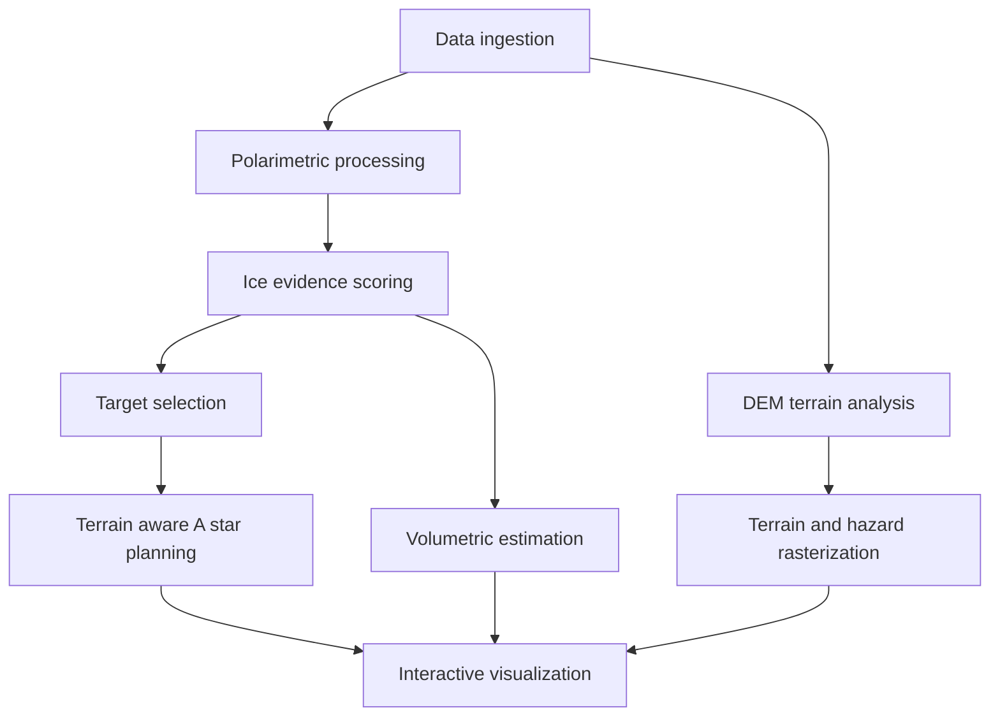

## Abstract

Renewed international interest in the lunar south pole is driven by its permanently shadowed regions (PSRs), unusual illumination conditions, volatile-preservation potential, and relevance to Artemis-era robotic and crewed exploration. Chandrayaan-2 has contributed an especially important observational capability through its Dual Frequency Synthetic Aperture Radar (DFSAR), which provides L- and S-band fully and hybrid-polarimetric observations of terrain that is difficult to characterize optically. However, lunar ice interpretation remains challenging because elevated circular polarization ratio (CPR) can arise from both volumetric scattering associated with ice and rough, block-rich terrain. Existing studies have advanced individual components of the problem, including radar decomposition, degree-of-polarization analysis, roughness discrimination, digital-elevation-model assessment, landing-site evaluation, crater and boulder detection, and rover path planning. These capabilities are rarely organized into a common decision-support workflow.

This paper provides a comparative analysis across six research domains and proposes the Lunar Autonomous Exploration Pipeline (LAEP), an engineering architecture for integrating complementary ice-evidence, terrain, hazard, volumetric-estimation, path-planning, and visualization methods. The proposed Ice Confidence Score combines CPR thresholding with degree-of-polarization and volumetric-scattering evidence, while terrain and hazard layers constrain terrain-aware A\* planning. LAEP is presented as a proposed integration design rather than a validated scientific result. Because the associated GitHub repository is unavailable for inspection, no software component is claimed as implemented. The paper therefore distinguishes published methods, proposed LAEP formulations, and future validation requirements.

## Keywords

Autonomy; Chandrayaan-2; crater detection; lunar south pole; polarimetric SAR; rover path planning; water ice

## I. Introduction

The lunar south pole has become a central target for contemporary planetary exploration. Its scientific importance arises from the combination of extreme topography, low solar elevation, permanently shadowed regions, cold traps, and potentially accessible deposits of water and other volatiles. The Moon’s low axial tilt allows portions of crater floors and depressions to remain without direct solar illumination for long periods. Illumination studies based on Lunar Orbiter Laser Altimeter (LOLA) topography have demonstrated that polar illumination varies strongly with local horizon geometry and that small topographic changes can substantially alter lighting conditions []. Later high-resolution analyses identified ridges and crater rims with comparatively favorable illumination near the south pole, including the connecting ridge between Shackleton and de Gerlache craters .

The renewed interest is also operational. Artemis-era exploration requires landing sites that are not merely scientifically attractive but also sufficiently safe, illuminated, communicative, accessible, and traversable. Engineering assessments of pre-selected Artemis III landing regions have therefore combined slope, illumination, and Earth-visibility conditions rather than relying on a single criterion []. Similarly, recent south-polar site studies have incorporated slope, roughness, temperature, illumination, accessibility to PSRs, compositional diversity, and trafficability []. These requirements create a systems problem: the highest-value science target may be inside a PSR, while the safest landing site may be on an illuminated ridge, requiring a traversable route across uncertain and hazardous terrain.

Remote sensing of polar volatiles is intrinsically multimodal. Optical sensors are constrained by darkness, low illumination, and viewing geometry, whereas radar can operate independently of sunlight. Chandrayaan-1 Mini-SAR and the Lunar Reconnaissance Orbiter Mini-RF established an important radar heritage for lunar polar investigations . The Chandrayaan-2 DFSAR instrument extended that heritage through dual-frequency L- and S-band observations and full-polarimetric capability. The instrument was designed to support high-resolution polar mapping, water-ice investigation, and regolith characterization []. DFSAR performance characterization and early data analyses established the value of its polarimetric products for lunar surface and subsurface interpretation [].

A major unresolved issue is the ambiguity of CPR. CPR is often used as an indicator of anomalous radar scattering, and values above unity have been associated with multiple scattering in ice-rich media. Nevertheless, rough surfaces, rocks, crater walls, fractured impact melt, and geometric scattering can also produce elevated CPR. Radar-scattering analyses have shown that dipole-like structures, dihedral geometries, and other geologic targets can generate CPR values above one []. Numerical and theoretical modeling likewise indicates that surface roughness, buried rocks, incidence angle, dielectric properties, and subsurface inclusions influence lunar radar signatures . Consequently, CPR alone should not be treated as a definitive ice detector.

Several recent studies address this ambiguity using complementary polarimetric features. Kumar et al. analyzed L-band DFSAR data over south-polar PSRs using Huynen, Barnes, and eigenvalue-based decompositions, reporting differences in CPR and volumetric-scattering behavior among selected PSRs and emphasizing the need to combine polarimetry with geomorphology []. Sinha et al. refined the volumetric-scattering criterion by combining CPR greater than one with low degree of polarization, using a threshold below 0.13 for the investigated doubly shadowed craters []. Muduli et al. used fractal dimension and Single-Bounce Eigenvalue Relative Difference (SERD), together with unsupervised clustering, to distinguish smoother high-CPR regions from roughness-related responses [paper\_id: 599494:9e331192-cf42-48a8-a9a3-cee2fa62c96c,30]. These studies provide complementary evidence types but do not, by themselves, form a complete operational pipeline from radar observation to terrain-aware exploration planning.

The same separation appears in terrain and mobility research. LOLA-derived digital elevation models (DEMs) support slope, illumination, horizon, and PSR analysis, but resolution and uncertainty influence the interpretation of meter-scale hazards []. Image-derived and shape-from-shading DEM refinements can provide additional local topographic detail, although their quality depends on image geometry, tie points, and processing assumptions . Rover research has developed traversability models, global planners, local obstacle avoidance, state-space search, genetic algorithms, and mission-integrated planning . However, these methods generally assume that science targets and hazard layers have already been prepared.

This paper addresses the resulting integration gap. Its main contribution is a comparative analysis of existing approaches across six domains: lunar ice and water detection, SAR and polarimetric analysis, terrain and hazard assessment, landing-site evaluation, rover path planning, and integrated planetary exploration systems. On that basis, it proposes LAEP as a software architecture that integrates complementary ice-evidence, terrain, hazard, path-planning, volumetric-estimation, and interactive visualization methods. The proposed pipeline is not presented as a validated experimental system. In particular, no numerical performance, accuracy, trained machine-learning model, autonomous rover simulation, real-time capability, or scientific result is claimed for LAEP. Since the GitHub repository associated with the project is not available for inspection, implementation status is treated conservatively, and all LAEP components are labeled proposed unless independently verifiable.

## II. Literature Survey

### 1. Lunar Ice and Water Detection

Evidence for lunar polar water has been assembled from radar, neutron spectroscopy, ultraviolet and near-infrared observations, thermal measurements, laser albedo, and impact experiments. The LCROSS impact experiment provided direct evidence for water in the ejecta plume from a permanently shadowed lunar crater [paper\_id: 599494:9dbac735-4c83-4171-9f23-6dc59c0e59bb,8,12]. Other studies have used temperature and reflectance constraints to identify regions consistent with surface ice [paper\_id: 599494:1a8cad9b-627a-4338-b848-a939a4465389,42,29]. These observations establish that water and other volatiles are scientifically plausible at the poles, but they do not eliminate uncertainty concerning spatial distribution, depth, concentration, physical form, or accessibility.

Radar-based detection is attractive because SAR observations are independent of solar illumination. Mini-SAR and Mini-RF studies used CPR and polarization behavior to investigate lunar polar craters and regolith properties . However, radar signatures are not unique to ice. High CPR may be caused by rough or blocky surfaces, crater walls, impact melt, and multiple reflections. The interpretation of polar radar anomalies has therefore been debated, particularly where high-CPR regions do not coincide with thermally favorable cold traps [].

The Chandrayaan-2 DFSAR mission was designed to improve this situation by combining L- and S-band observations with full and hybrid polarimetry. L-band can provide greater penetration into dry, low-loss regolith than shorter wavelengths, while the availability of multiple polarization channels supports analysis of scattering mechanisms []. The instrument’s dual-frequency design also allows differences between wavelength-dependent responses to be examined, although frequency-dependent interpretation remains sensitive to surface roughness, dielectric properties, incidence angle, and calibration.

Complementary non-radar approaches remain important. Neutron measurements can indicate enhanced hydrogen abundance, thermal instruments constrain volatile stability, ultraviolet measurements can identify reflectance anomalies, and laser altimetry can contribute albedo and topographic information. A framework for coordinated south-polar volatile exploration has emphasized the need to combine measurements from multiple instruments and missions rather than interpreting any single proxy in isolation [paper\_id: 599494:1a8cad9b-627a-4338-b848-a939a4465389,37,23]. LAEP adopts this principle conceptually, although complementary neutron, thermal, and laser-albedo datasets are future inputs rather than verified current components.

### 2. SAR and Polarimetric Analysis

SAR analysis can be organized into four broad families: backscatter and CPR methods, model-based decompositions, eigenvalue/eigenvector methods, and multi-feature or multi-frequency approaches.

CPR is computationally simple and physically interpretable as a ratio of same-sense to opposite-sense circularly polarized returns. Its principal advantage is that it can be calculated from limited polarimetric information and compared across broad regions. Its central weakness is nonuniqueness. Campbell demonstrated that CPR values above one can arise from several geological scattering mechanisms, including dipoles, cracks, edges, and natural corner reflectors []. Fa and Cai similarly investigated CPR behavior in impact craters and its implications for polar ice interpretation [paper\_id: 599494:1a8cad9b-627a-4338-b848-a939a4465389,42,29].

Model-based decompositions assign observed radar power to idealized surface, double-bounce, and volume-scattering components. DFSAR studies have applied Huynen, Barnes, Freeman-Durden, Yamaguchi, and related decompositions to characterize lunar terrains . These methods produce physically meaningful information products, but their assumptions may be violated by lunar slopes, orientation effects, nonreflection-symmetric terrain, and mixtures of scattering mechanisms. Dielectric-constant retrieval studies found that conventional decomposition performance can degrade over slopes, craters, and subsurface soil samples, motivating specialized branching and unitary-rotation procedures [].

Eigenvalue-based methods, including entropy, anisotropy, alpha angle, SERD, and degree of polarization, offer a model-free or less model-dependent description of scattering diversity and depolarization. DFSAR crater analyses have related SERD and other polarimetric parameters to roughness and dielectric properties . The advantage is greater sensitivity to complex or mixed scattering. The limitation is interpretive: an eigenvalue parameter does not automatically identify ice and must be related to physical terrain hypotheses.

Kumar et al. used a combination of polarimetric decompositions and eigenvalue parameters over selected south-polar PSRs. Their analysis suggested that one PSR exhibited high CPR and volumetric scattering that could be consistent with ice clusters, while another showed lower CPR despite volumetric-scattering contributions []. The important methodological conclusion is not that CPR or volume scattering independently confirms ice, but that the spatial and physical context must be considered.

Sinha et al. made this integration more explicit by combining CPR and degree of polarization. Their analysis of nine doubly shadowed craters in Faustini, Haworth, and Shoemaker identified a subset with CPR greater than one and degree of polarization below 0.13, interpreting the joint condition as a refined indicator of volumetric scattering associated with subsurface ice []. The criterion is valuable as an evidence layer for LAEP, but it remains an empirical diagnostic derived from particular observations and should not be treated as universally validated.

Muduli et al. addressed CPR ambiguity with a different strategy. Fractal dimension and SERD were used as roughness indicators, and K-means, Gaussian mixture models, and agglomerative hierarchical clustering were applied without labeled ground truth. The study intersected smooth classes with CPR greater than one to isolate potential ice-bearing regions [paper\_id: 599494:9e331192-cf42-48a8-a9a3-cee2fa62c96c,30] [paper\_id: 599494:9e331192-cf42-48a8-a9a3-cee2fa62c96c,32]. This approach is promising for an evidence-fusion architecture because it supplies a roughness-screening layer without requiring extensive lunar labels. Nevertheless, its reported findings are specific to the investigated crater and cannot be transferred to LAEP as performance results.

### 3. Terrain and Hazard Assessment

Terrain assessment begins with a DEM from LOLA, LROC imagery, or another topographic source. Derivatives commonly include slope, aspect, curvature, local relief, roughness, hillshade, and visibility. Illumination modeling additionally requires horizon profiles and temporal solar geometry. Mazarico et al. used LOLA topography to characterize polar illumination, PSR extent, and locations with favorable sunlight []. Subsequent high-resolution LOLA products reduced track geolocation errors and quantified elevation and slope uncertainty for priority landing regions [].

DEM resolution is important because polar hazards may be comparable to or smaller than the raster cell size. Shape-from-shading and multiview image-based refinement can recover additional local detail, but they introduce dependencies on image alignment, illumination assumptions, and ground control . A decision-support pipeline should therefore retain source resolution and uncertainty metadata rather than treating all terrain derivatives as equally reliable.

Hazard assessment can be performed directly from terrain derivatives or through feature detection. Slope masks are relatively straightforward, while roughness requires a scale definition. A surface can be smooth at a rover-wheel scale but rough at a radar wavelength or landing-gear scale. Consequently, roughness should be represented as a family of scale-dependent layers rather than a single universal value.

Craters and boulders represent additional hazards and geomorphological indicators. Shah et al. evaluated YOLOv11 and RE-DETR for crater and boulder detection in Chandrayaan-2 OHRC imagery [paper\_id: 599494:20f57c67-b8fb-40d0-b498-345378ef0877,1,1]. Their work demonstrates the relevance of high-resolution optical detection for hazard mapping, but the reported model results belong to that study and are not LAEP results. For LAEP, object detections should be treated as candidate hazard observations requiring georeferencing, confidence handling, and fusion with DEM-derived masks.

### 4. Lunar Landing-Site Evaluation

Landing-site evaluation is inherently multicriteria. Scientific value may include proximity to PSRs, volatile indicators, geological diversity, and access to representative terrain. Engineering suitability may include slope, roughness, illumination, communication, thermal environment, and landing ellipse safety.

The de-Gerlache–Shackleton ridge study evaluated candidate sites using terrain characteristics, illumination, roughness, temperature, accessibility to PSRs, compositional diversity, and trafficability []. Its central contribution is a structured comparison between science opportunity and technical feasibility. LOLA-based Artemis assessments likewise evaluated illumination, Earth visibility, and slope across pre-selected landing sites [].

Machine-learning and clustering methods provide another strategy. A self-organizing-map approach combined scientific variables such as hydrogen abundance and distance to water-ice indicators with engineering variables such as slope, roughness, Sun visibility, and Earth visibility []. The method’s advantage is the ability to identify multidimensional clusters without manually defining every boundary. Its limitation is that cluster suitability depends on feature selection, scaling, weights, and the interpretation of the resulting groups.

Landing-site selection is upstream of rover planning but should not be isolated from it. A landing site with high scientific value may be unusable if a safe route to the target does not exist. Conversely, a landing site with favorable engineering properties may provide poor access to high-confidence ice evidence. LAEP therefore treats landing zones, targets, and traverses as linked products.

### 5. Rover Path Planning

Rover planning methods vary in abstraction level. At the local level, the planner avoids obstacles and unsafe terrain using a traversability grid. At the global level, it chooses a route between regions or waypoints. At the mission level, it orders scientific targets while considering time, energy, communication, illumination, and operational constraints.

Gennery described a terrain-analysis approach that estimates height, slope, roughness, uncertainty, and traversability probability from three-dimensional data, then uses a cost function and parallel search to find a minimum-cost route []. MER navigation combined local GESTALT traversability assessment with a global Field D\* planner to improve long-range navigation and obstacle avoidance []. Mission-integrated planning has also combined spatial obstacle maps with a temporal state space for synchronized path and task planning [].

Lunar polar planning introduces additional constraints. Shadow can affect solar power, while terrain and local geometry can affect communications. A recent south-pole mission planner used a genetic algorithm to determine an order of exploration for points of interest and then computed trajectories satisfying obstacle, communication, and solar-illumination conditions []. This approach is more mission-level than a standalone A\* planner.

A terrain-aware A\* planner is attractive for LAEP because it is transparent, reproducible, and suitable for a rasterized cost surface. It can incorporate slope, roughness, crater exclusion, boulder exclusion, ice confidence, distance, and optional illumination penalties. However, A\* alone does not constitute autonomous rover operation. It produces a candidate route on a supplied map; it does not guarantee localization, perception, wheel-soil interaction modeling, fault management, or onboard autonomy.

### 6. Integrated Planetary Exploration Systems

Integrated systems combine heterogeneous data products and convert them into operational decisions. Examples include software tools for SAR processing, GIS-based landing-site studies, mission planners, and coordinated volatile-exploration frameworks.

MIDAS was developed as a software tool for processing and analyzing Chandrayaan-2 DFSAR data, with graphical capabilities for polarimetric and radiometric analysis []. Its contribution is specialized radar processing and user accessibility. It does not, by itself, provide a complete chain from ice evidence to terrain-aware rover routing.

The coordinated volatile-exploration framework emphasizes that water-ice investigation should combine radar, neutron, thermal, optical, and topographic observations [paper\_id: 599494:1a8cad9b-627a-4338-b848-a939a4465389,37,23]. This systems perspective is closely aligned with LAEP, although LAEP additionally proposes explicit hazard rasterization, path planning, volumetric estimation, and interactive GIS/3D presentation.

The literature therefore contains most of the required ingredients, but generally as separate methods. The research opportunity is not to claim a new radar physics model or a validated autonomous rover system. It is to define a transparent integration architecture that preserves uncertainty and makes the relationship between evidence, hazards, targets, and routes explicit.

## III. Comparative Taxonomy

Table I classifies representative methods according to sensing or computational modality, information product, and the principal gap left uncovered.

**TABLE I**
**TAXONOMY OF LUNAR SOUTH-POLAR EXPLORATION METHODS**

| Domain                | Modality or method family                       | Primary information product                              | Main decision supported                     | Gap left uncovered                                  |
| --------------------- | ----------------------------------------------- | -------------------------------------------------------- | ------------------------------------------- | --------------------------------------------------- |
| Ice detection         | CPR from Mini-SAR, Mini-RF, DFSAR               | High-CPR mask                                            | Candidate anomalous-scattering regions      | CPR is not unique to ice                            |
| Ice detection         | Neutron, thermal, UV, laser-albedo observations | Hydrogen, temperature, reflectance, or albedo evidence   | Volatile plausibility and stability         | Different spatial scales and incomplete coverage    |
| SAR analysis          | Huynen, Barnes, model-based decompositions      | Surface, double-bounce, and volume-scattering components | Scattering-mechanism interpretation         | Model assumptions and orientation sensitivity       |
| SAR analysis          | H/α/A, SERD, entropy, anisotropy               | Eigenvalue-based scattering descriptors                  | Roughness and depolarization discrimination | Physical interpretation is indirect                 |
| SAR analysis          | CPR plus DOP                                    | Joint volumetric-scattering indicator                    | Refined ice-evidence screening              | Threshold transferability and lack of ground truth  |
| Roughness analysis    | Fractal dimension, SERD, local radar statistics | Smooth/rough surface classes                             | CPR false-positive reduction                | Scale dependence and unsupervised class labeling    |
| Terrain assessment    | LOLA or LROC DEM                                | Elevation, slope, aspect, relief                         | Landing and mobility screening              | Resolution, uncertainty, and local hazards          |
| Illumination analysis | Horizon and solar-geometry modeling             | Sunlight duration and PSR masks                          | Power and thermal planning                  | Time dependence and model assumptions               |
| Hazard detection      | Optical crater and boulder detection            | Georeferenced obstacle candidates                        | Landing and traverse safety                 | Detection errors and registration requirements      |
| Landing evaluation    | Weighted multicriteria methods                  | Suitability map or ranked sites                          | Candidate landing-site selection            | Weight subjectivity and limited route coupling      |
| Landing evaluation    | SOM and related clustering                      | Multidimensional site classes                            | Unsupervised site screening                 | Interpretability and validation                     |
| Path planning         | A\*, D\*, Field D\*, grid search                | Minimum-cost route                                       | Point-to-point traverse generation          | Static map assumptions and no vehicle autonomy      |
| Mission planning      | Genetic algorithm and task scheduling           | Target order and time allocation                         | Science campaign sequencing                 | Computational complexity and uncertain observations |
| Integrated systems    | MIDAS-like radar tools                          | Processed radar layers and visualization                 | Expert polarimetric interpretation          | Limited cross-domain decision integration           |
| Proposed LAEP         | Multi-modal GIS and service pipeline            | Evidence, hazard, route, and volume products             | End-to-end exploration support              | Requires implementation and validation              |

The taxonomy reveals three levels of information. First, **observations** include radar channels, DEM cells, optical pixels, and complementary instrument measurements. Second, **interpreted layers** include CPR, DOP, decompositions, slope, roughness, crater detections, and illumination masks. Third, **decision products** include ice-confidence maps, landing-site rankings, rover routes, and estimated ice volumes. Much of the literature focuses on the first two levels. LAEP is intended to connect the second level to the third without implying that the intermediate interpretations are certain.

A useful conceptual distinction is between *evidence* and *actionability*. A high-CPR pixel may be scientifically interesting but operationally inaccessible. A low-slope region may be safe but scientifically unremarkable. A route to a PSR may be short but energy-infeasible. The proposed pipeline therefore treats exploration planning as a constrained combination of evidence quality, terrain safety, accessibility, and mission objectives.

## IV. Existing Methods Comparison

### A. Comparative Synthesis by Domain

**TABLE II**
**COMPARISON OF REPRESENTATIVE ICE-DETECTION AND SAR APPROACHES**

| Instrument or data type          | Method                               | Output                                       | Strengths                                        | Limitations                                         |
| -------------------------------- | ------------------------------------ | -------------------------------------------- | ------------------------------------------------ | --------------------------------------------------- |
| Earth-based and spacecraft radar | CPR thresholding and anomaly mapping | High-CPR regions                             | Simple, interpretable, broad applicability       | Roughness and rocks can mimic ice                   |
| Mini-SAR and Mini-RF             | Hybrid-polarimetric decomposition    | Scattering classes and CPR                   | Heritage and polar coverage                      | Less complete polarimetric information than DFSAR   |
| DFSAR L/S full polarimetry       | Huynen and Barnes decomposition      | Surface, double-bounce, volume contributions | Uses full polarimetric information               | Decomposition assumptions and orientation effects   |
| DFSAR full polarimetry           | H/α/A and eigenvalue features       | Entropy, alpha, anisotropy, DOP, SERD        | Sensitive to mixed scattering and depolarization | Indirect physical interpretation                    |
| DFSAR full polarimetry           | CPR plus DOP                         | Joint volumetric-scattering criterion        | Reduces CPR-only ambiguity                       | Threshold is not universally validated              |
| DFSAR SLI and T3 products        | FD, SERD, clustering                 | Smooth/rough classes intersected with CPR    | Does not require labeled ground truth            | Unsupervised class semantics and scale dependence   |
| DFSAR with dielectric modeling   | TCD and related retrievals           | Dielectric constant estimates                | Adds physical surface-property information       | Sensitive to slopes, craters, and model assumptions |

The comparison indicates a progression from scalar anomaly detection toward multidimensional scattering interpretation. CPR remains valuable as a first-stage screening variable, but it should be combined with DOP, roughness, terrain morphology, and—where available—thermal or neutron evidence. DFSAR is particularly suitable for such integration because it provides full polarimetry and dual-frequency observations .

**TABLE III**
**COMPARISON OF TERRAIN, LANDING, AND MOBILITY APPROACHES**

| Data type                     | Method                                | Output                                 | Strengths                                 | Limitations                                         |
| ----------------------------- | ------------------------------------- | -------------------------------------- | ----------------------------------------- | --------------------------------------------------- |
| LOLA DEM                      | Slope, horizon, illumination modeling | Slope and sunlight/PSR layers          | Physically meaningful and polar-specific  | Resolution and topographic uncertainty              |
| High-resolution LOLA products | Error-aware DEM derivatives           | Elevation and slope with uncertainty   | Supports risk-aware site studies          | Regional coverage and computational burden          |
| LROC imagery and SfS          | Image-refined DEM                     | Local topography and hazards           | Potentially meter-scale detail            | Illumination and registration sensitivity           |
| OHRC imagery                  | Crater and boulder object detection   | Candidate hazard bounding boxes        | Direct fine-scale hazard evidence         | Model errors, false detections, and georegistration |
| Multicriteria GIS             | Weighted suitability analysis         | Site ranking or suitability map        | Transparent and easy to inspect           | Subjective weights and threshold dependence         |
| SOM and related clustering    | Unsupervised site classification      | Site classes and feature relationships | Captures multidimensional structure       | Requires interpretation and independent validation  |
| Raster traversability         | A\*, D\*, or Field D\*                | Minimum-cost route                     | Efficient and explainable                 | Static terrain representation                       |
| Mission planning              | Genetic algorithms and scheduling     | Target order and temporal plan         | Handles multiple objectives and waypoints | More complex and not necessarily locally optimal    |
| Local rover autonomy          | Stereo-based traversability           | Immediate obstacle avoidance           | Supports closed-loop navigation           | Requires onboard sensing and autonomy               |

### B. Explicit Gap Analysis

#### 1) CPR ambiguity

The first gap is physical ambiguity. Elevated CPR is a useful anomaly indicator but is not uniquely diagnostic of ice. Roughness, boulders, impact melt, cracks, dihedral structures, and multiple reflections can produce similar signatures . A pipeline that labels every CPR-greater-than-one pixel as ice risks converting a radar anomaly into an unsupported resource claim.

The literature offers several remedies: DOP-based discrimination, eigenvalue descriptors, roughness indicators, dielectric retrieval, morphology, and complementary thermal or neutron evidence. These remedies are rarely expressed as a common confidence model with explicit provenance. LAEP addresses this gap by proposing an Ice Confidence Score that combines multiple evidence terms while retaining the individual layers for inspection.

#### 2) Lack of ground truth

The second gap is the scarcity of validated in situ ground truth. Lunar polar remote sensing studies generally infer ice from convergent evidence, physical models, or comparisons between instruments. Even when independent datasets exist, they may differ in resolution, acquisition geometry, depth sensitivity, and spatial registration. Muduli et al. explicitly framed unsupervised classification as a response to the difficulty of obtaining labeled lunar data [paper\_id: 599494:9e331192-cf42-48a8-a9a3-cee2fa62c96c,7]. LAEP therefore should not output a binary claim of confirmed ice. It should produce an evidence score, evidence decomposition, and uncertainty or data-quality flags.

#### 3) Single-domain silos

The third gap is organizational. Radar studies often stop at scattering interpretation. DEM studies often stop at slope or illumination. Landing-site studies may rank sites without generating routes. Path planners may assume that targets and hazards are already known. The scientific and engineering layers are therefore connected conceptually but not necessarily computationally.

#### 4) Lack of decision-grade fusion products

The fourth gap concerns the form of outputs. A scientific map of high CPR is not automatically a landing decision, and a slope map is not automatically a traverse plan. Decision-grade products should identify candidate targets, show the evidence supporting each target, quantify relevant terrain constraints, and provide feasible routes with interpretable cost contributions.

#### 5) Absence of end-to-end pipelines

The fifth gap is the lack of a transparent end-to-end pipeline covering data ingestion, polarimetric processing, evidence fusion, terrain and hazard mapping, route generation, volumetric estimation, and visualization. Existing tools such as MIDAS provide important DFSAR processing capabilities [], while mission planners and rover-navigation systems address planning problems . LAEP is proposed as an architectural bridge between these capabilities, not as a replacement for them.

## V. Proposed LAEP Architecture and Workflow

LAEP is proposed as a modular software pipeline for lunar south-polar exploration analysis. It is intended to connect orbital evidence with terrain-aware exploration decisions while preserving the distinction between measurements, derived products, assumptions, and decisions.

The proposed architecture contains five logical layers:

1. **Data layer:** calibrated DFSAR products, DEMs, PSR and crater masks, optical imagery, hazard detections, and optional complementary datasets.
2. **Processing layer:** polarimetric calculations, terrain derivatives, morphology extraction, raster alignment, and quality control.
3. **Evidence layer:** CPR, DOP, volumetric-scattering indicators, roughness screening, terrain suitability, and Ice Confidence Score generation.
4. **Planning layer:** target selection, hazard-aware cost-surface construction, A\* route generation, and optional mission-level scheduling.
5. **Presentation layer:** interactive GIS and 3-D visualization, downloadable raster/vector products, and API access.

The proposed software stack consists of a React front end, OpenLayers for two-dimensional GIS visualization, Three.js for three-dimensional terrain and layer rendering, and a FastAPI backend for processing services and product delivery. These technologies describe the proposed architecture only. Because the GitHub repository is unavailable, none of these components is claimed as implemented in this paper.

### A. Workflow Stages and Status

**TABLE IV**
**LAEP WORKFLOW STATUS**

| Stage                        | Function                                                                       | LAEP status |
| ---------------------------- | ------------------------------------------------------------------------------ | ----------- |
| Data ingestion               | Load DFSAR, DEM, PSR, imagery, and optional hazard products                    | Proposed    |
| Polarimetric processing      | Derive CPR, DOP, coherency, decomposition, and quality layers                  | Proposed    |
| Ice-evidence scoring         | Combine CPR, DOP, volumetric scattering, roughness, and context                | Proposed    |
| Terrain/hazard rasterization | Generate slope, roughness, crater, boulder, and exclusion layers               | Proposed    |
| Path planning                | Use terrain-aware A\* over a fused cost surface                                | Proposed    |
| Volumetric estimation        | Estimate ice volume from scored area, thickness, and concentration assumptions | Proposed    |
| Visualization                | Present layers and routes using React, OpenLayers, and Three.js                | Proposed    |
| Backend services             | Expose processing and query functions through FastAPI                          | Proposed    |
| Validation                   | Compare against complementary data and in situ observations                    | Future      |

### B. Workflow Description

#### Stage 1: Data ingestion

The ingestion layer would accept calibrated DFSAR full-polarimetric data, map-projected products, DEMs, PSR polygons, crater boundaries, optical imagery, and optional external evidence. Metadata would record spatial reference, acquisition geometry, frequency, polarization mode, resolution, and uncertainty. Resampling should be explicit because radar and DEM products may have different spatial grids.

#### Stage 2: Polarimetric processing

The processing layer would calculate CPR and DOP from the scattering or Stokes representation, construct coherency or covariance matrices, and derive selected decomposition and eigenvalue features. The design allows both conventional decomposition layers and specialized roughness indicators. Quality checks would include missing channels, invalid values, co-polarization consistency, and registration status.

#### Stage 3: Ice-evidence scoring

The scoring layer would combine thresholded CPR, low-DOP evidence, volumetric-scattering evidence, roughness screening, PSR or doubly shadowed context, and optional complementary measurements. The result would be a continuous Ice Confidence Score rather than an unqualified ice/no-ice label.

#### Stage 4: Terrain and hazard rasterization

The terrain layer would derive slope, roughness, local relief, curvature, and optional illumination penalties from the DEM. Crater and boulder detections would be converted into georeferenced hazard rasters with buffers. A hazard layer should distinguish hard exclusions from soft penalties. For example, a large boulder may be a hard exclusion, while moderate slope may be a traversability penalty.

#### Stage 5: Path planning

The planner would construct a cost surface and apply terrain-aware A\*. Candidate destinations could include high-ICS zones, crater interiors, sampling targets, or scientific waypoints. The output would contain the route geometry, cumulative cost, distance, and layer-specific cost contributions. This is a planning product, not an autonomous rover controller.

#### Stage 6: Volumetric estimation

The volumetric module would estimate potential ice volume by integrating area, assumed thickness, and an assumed ice fraction over selected cells. Because remote sensing does not directly provide a universally validated thickness or concentration map, the output should be scenario-based, such as conservative, nominal, and optimistic assumptions.

#### Stage 7: Visualization

The visualization layer would allow users to inspect source layers, evidence components, hazards, routes, and volume scenarios in a common coordinate framework. OpenLayers would support two-dimensional map interaction, while Three.js would support 3-D terrain display. The purpose is traceability: users should be able to identify why a cell received a high score and why a route avoided a region.

## VI. Methodology

All formulations in this section are proposed LAEP formulations. They are not validated results, and the coefficients and thresholds should be calibrated or sensitivity-tested in future work.

### A. Polarimetric Preliminaries

Let the complex scattering matrix for a fully polarimetric DFSAR observation be

$$
\mathbf{S} =
\begin{bmatrix}
S_{HH} & S_{HV} \\
S_{VH} & S_{VV}
\end{bmatrix}.
$$

For a reciprocal monostatic system, S\_{HV} and S\_{VH} may be expected to be similar after calibration, although lunar observations lack conventional terrestrial corner-reflector calibration. Derived products should therefore preserve a data-quality flag rather than silently assuming ideal reciprocity.

A CPR formulation based on the scattering channels may be written as

$$
CPR =
\frac{|S_{HH}|^2 + |S_{VV}|^2 + 4|S_{HV}|^2
-2\operatorname{Re}(S_{HH}S_{VV}^{*})}
{|S_{HH}|^2 + |S_{VV}|^2 + 2\operatorname{Re}(S_{HH}S_{VV}^{*})}.
$$

The exact implementation should follow the selected polarization convention and product definition. CPR values above one can be used as a screening condition, but not as a sufficient ice criterion.

For Stokes parameters S\_1,S\_2,S\_3,S\_4, the degree of polarization may be represented as

$$
DOP =
\frac{\sqrt{S_2^2+S_3^2+S_4^2}}{S_1}.
$$

The proposed LAEP interpretation is that elevated CPR combined with low DOP provides stronger evidence of depolarizing volumetric scattering than CPR alone. The threshold DOP<0.13 is included as a configurable starting value because it was proposed for a specific set of doubly shadowed craters by Sinha et al. []. It must not be interpreted as a universally established lunar constant.

### B. Proposed Ice Confidence Score

Let the following normalized layers be defined for pixel i:

- c\_i: CPR evidence;
- d\_i: low-DOP evidence;
- v\_i: volumetric-scattering evidence from polarimetric decomposition;
- r\_i: smoothness or low-roughness evidence;
- p\_i: PSR or doubly shadowed contextual evidence;
- m\_i: morphology and crater-context evidence;
- q\_i: data-quality factor.

A proposed Ice Confidence Score is

$$
ICS_i =
q_i \left[
w_c c_i +
w_d d_i +
w_v v_i +
w_r r_i +
w_p p_i +
w_m m_i
\right],
$$

where

$$
w_c+w_d+w_v+w_r+w_p+w_m=1,\qquad
0\leq w_k\leq1.
$$

The CPR term may be defined with a soft threshold:

$$
c_i =
\operatorname{clip}
\left(
\frac{CPR_i-CPR_{\min}}
{CPR_{\max}-CPR_{\min}},
0,1
\right).
$$

A binary screening version is

$$
c_i =
\begin{cases}
1,& CPR_i>1,
0,& CPR_i\leq1.
\end{cases}
$$

The DOP term can similarly be defined as

$$
d_i =
\begin{cases}
1,& DOP_i<\tau_{DOP},
0,& DOP_i\geq\tau_{DOP},
\end{cases}
$$

with

$$
\tau_{DOP}=0.13
$$

as a proposed configurable default, not a validated LAEP result.

To prevent a high CPR value from dominating the score, a conjunctive term may be added:

$$
ICS_i =
q_i\left[
\sum_k w_k x_{k,i}
+
w_{cd}c_i d_i
\right],
$$

with the weights renormalized. This formulation rewards agreement between CPR and low-DOP evidence.

An alternative conservative score is a geometric mean:

$$
ICS_i =
q_i
\left(
c_i^{w_c}
d_i^{w_d}
v_i^{w_v}
r_i^{w_r}
p_i^{w_p}
m_i^{w_m}
\right).
$$

The geometric form penalizes cells where one required evidence layer is absent, whereas the additive form allows strong evidence in one layer to compensate for missing evidence elsewhere. LAEP should support both modes for sensitivity analysis.

### C. Terrain Derivatives

Let z(x,y) denote DEM elevation. The slope magnitude is

$$
s(x,y)=
\tan^{-1}
\left(
\sqrt{
\left(\frac{\partial z}{\partial x}\right)^2+
\left(\frac{\partial z}{\partial y}\right)^2
}
\right).
$$

A normalized slope penalty can be expressed as

$$
C_s(x,y)=
\operatorname{clip}
\left(
\frac{s(x,y)-s_{\min}}
{s_{\max}-s_{\min}},
0,1
\right).
$$

Terrain roughness may be estimated using local elevation dispersion:

$$
R_\sigma(x,y)=
\sqrt{
\frac{1}{N}
\sum_{j\in\mathcal{N}(x,y)}
(z_j-\bar z)^2
}.
$$

Other roughness measures, including local relief, curvature, fractal dimension, and radar-derived SERD, may be retained as separate layers because they represent different spatial scales. The DEM-derived roughness should not be assumed equivalent to radar-wavelength roughness.

A terrain suitability layer can be defined as

$$
T(x,y)=
1-\left[
\lambda_s C_s(x,y)
+\lambda_r C_r(x,y)
+\lambda_\kappa C_\kappa(x,y)
\right],
$$

where C\_r and C\_\kappa are normalized roughness and curvature penalties. Values should be clipped to the interval [0,1].

### D. Hazard Overlays

Let H\_c(x,y) represent crater hazards and H\_b(x,y) represent boulder hazards. These may be generated from mapped features, object-detection bounding boxes, DEM depressions, or manually curated polygons. A buffered hazard mask is

$$
H(x,y)=
1-\left(1-H_c(x,y)\right)
\left(1-H_b(x,y)\right).
$$

For hard exclusions,

$$
H(x,y)=1
\quad\Rightarrow\quad
C_{\text{move}}(x,y)=+\infty.
$$

For soft penalties,

$$
C_H(x,y)=\lambda_H H(x,y).
$$

The distinction is operationally important. A detected boulder with uncertain geolocation may warrant a high cost and a safety buffer rather than an absolute exclusion. The hazard product should therefore retain detection confidence, source resolution, and buffer distance.

### E. Terrain-Aware A\* Cost Function

Represent the traversable region as a graph $G=(V,E)$, where each cell is a node and neighboring cells are connected by edges. Let $e=(i,j)$ connect adjacent cells. A proposed edge cost is

$$
C(e)=
\ell(e)
\left[
\lambda_d
+\lambda_s \bar C_s(e)
+\lambda_r \bar C_r(e)
+\lambda_H \bar C_H(e)
+\lambda_I \bar C_I(e)
+\lambda_P \bar C_P(e)
\right],
$$

where:

- \ell(e) is edge distance;
- \bar C\_s(e) is mean slope penalty;
- \bar C\_r(e) is mean roughness penalty;
- \bar C\_H(e) is hazard penalty;
- \bar C\_I(e) is illumination or energy penalty;
- \bar C\_P(e) is communication or PSR-related penalty.

If scientific targets are desirable rather than hazardous, an optional science reward may be introduced:

$$
C'(e)=C(e)-\lambda_{\text{science}}\bar{ICS}(e).
$$

This reward must be bounded to prevent the planner from selecting scientifically attractive but physically unsafe paths. One safe formulation is to apply the science score only at terminal target selection, while using safety-only costs along the route.

A\* uses the evaluation function

$$
f(n)=g(n)+h(n),
$$

where g(n) is accumulated path cost and h(n) is an admissible estimate of remaining cost. For a raster with nonnegative costs, a Euclidean or diagonal-distance heuristic multiplied by the minimum possible per-distance cost is appropriate. The proposed planner should return failure when no route exists rather than silently crossing excluded cells.

### F. Volumetric Ice Estimation

A simple scenario-based volume estimate is

$$
V_{\text{ice}} =
\sum_{i\in\Omega}
A_it_i\phi_i\rho_i,
$$

where:

- A\_i is pixel area;
- t\_i is assumed ice-bearing thickness;
- \phi\_i is ice volume fraction;
- \rho\_i is an optional density factor;
- \Omega is the selected set of pixels.

If the objective is volume rather than mass, density is omitted:

$$
V_{\text{ice}} =
\sum_{i\in\Omega}
A_it_i\phi_i.
$$

Because CPR, DOP, and polarimetric decomposition do not directly determine t\_i and \phi\_i without additional calibration and physical modeling, LAEP should expose these as scenario parameters. A conservative estimate may use only cells exceeding multiple evidence thresholds and a lower thickness assumption; an optimistic estimate may use a broader confidence interval. These are planning scenarios, not measurements.

## VII. Preliminary/Implemented Components

The implementation status of LAEP requires particular care. The associated GitHub repository is not available for inspection in the present writing context. Therefore, no component can be independently attributed to the user’s repository, and this paper does not claim that any of the following has been implemented, trained, tested, or deployed.

The following items are **proposed architecture components**:

1. A DFSAR ingestion and polarimetric-processing service.
2. CPR and DOP calculation from calibrated full-polarimetric observations.
3. Huynen, Barnes, H/α/A, SERD, and volumetric-scattering information layers.
4. An Ice Confidence Score combining radar and contextual evidence.
5. DEM-derived slope, roughness, curvature, relief, and terrain-cost rasters.
6. Crater and boulder hazard overlays derived from optical detections or imported vector data.
7. Terrain-aware A\* planning over a fused cost surface.
8. Scenario-based volumetric ice estimation.
9. A React/OpenLayers two-dimensional interface.
10. A Three.js three-dimensional terrain viewer.
11. A FastAPI backend exposing processing, query, and visualization services.

The following items are **not claimed**:

- No machine-learning model is claimed to have been trained for LAEP.
- No YOLOv11 or other crater/boulder detector is claimed to be implemented in LAEP.
- No autonomous rover simulation is claimed.
- No real-time capability is claimed.
- No accuracy, precision, recall, F-score, mAP, route-optimality, runtime, memory, or volume-estimation result is claimed.
- No dataset usage, number of processed scenes, crater count, spatial coverage, or experimental outcome is claimed for LAEP.
- No validation against neutron, thermal, laser-albedo, ShadowCam, or in situ measurements is claimed.
- No scientific confirmation of lunar ice is claimed by the proposed pipeline.

The distinction between published capability and project implementation is essential. For example, the YOLOv11 crater and boulder study provides an externally published approach for OHRC imagery [paper\_id: 599494:20f57c67-b8fb-40d0-b498-345378ef0877,1,1], but that does not establish that LAEP contains the same model. Similarly, MIDAS provides a published DFSAR-processing tool [], but its existence does not imply that a FastAPI-based LAEP backend has been completed.

If a future repository audit confirms source files, modules, or documented endpoints, implementation claims should be updated narrowly and file-by-file. Until then, the appropriate status for the entire LAEP architecture is **proposed**.

## VIII. Discussion

LAEP’s primary contribution is architectural integration rather than a new validated scientific discovery. The literature already contains strong individual methods for radar interpretation, topographic analysis, landing-site selection, and rover planning. The challenge is to make their assumptions visible and their outputs interoperable.

The first integration benefit concerns CPR ambiguity. A CPR-only map can overstate ice potential because rough terrain and rock abundance may produce similar radar behavior. LAEP proposes to combine CPR with DOP, volumetric-scattering descriptors, roughness, DEM morphology, and PSR context. This design reflects the direction of recent research: Sinha et al. used CPR and DOP jointly [], while Muduli et al. used CPR with independent roughness indicators [paper\_id: 599494:9e331192-cf42-48a8-a9a3-cee2fa62c96c,30]. LAEP does not claim that the resulting score resolves ambiguity; it makes the ambiguity explicit and provides a mechanism for comparing evidence layers.

The second benefit is traceability. A black-box suitability label is difficult to evaluate scientifically or operationally. LAEP’s proposed interactive interface would allow an analyst to inspect CPR, DOP, decomposition, roughness, slope, hazards, and route layers separately. Such traceability is especially important where no ground truth exists. An analyst could determine whether a high ICS value comes primarily from CPR, low DOP, PSR context, or an assumed morphology layer.

The third benefit is the connection between scientific targeting and mobility. Existing landing-site studies evaluate scientific and engineering constraints , while rover planners generate routes under terrain, energy, communication, or target-order constraints . LAEP proposes that high-value science targets be passed directly into route planning, with hazards and terrain constraints applied before a route is accepted.

Relative to MIDAS, LAEP is broader and more decision-oriented. MIDAS addresses DFSAR data processing and analysis through a dedicated software tool []. LAEP would conceptually use comparable radar-derived products but extend beyond radar processing into terrain, hazard, volumetric, routing, and web visualization layers. LAEP should therefore be understood as complementary rather than competitive.

Relative to SOM-based site selection, LAEP is more explicitly evidence-to-route oriented. SOM methods can identify multidimensional site classes using scientific and engineering features []. LAEP could incorporate SOM outputs as an optional landing-site screening layer, but its core proposal is not unsupervised site clustering. Instead, it uses interpretable evidence scoring and cost-surface planning. A future hybrid system could use SOM or another clustering method to generate candidate zones and then use ICS and A\* for target and route refinement.

Relative to genetic-algorithm mission planners, LAEP’s A\* component is intentionally narrower. The genetic-algorithm approach described for south-polar rover planning optimizes waypoint order and then computes feasible trajectories while considering solar and communication conditions []. LAEP’s proposed A\* planner would primarily compute a route between a start location and a selected target. It would not replace mission-level scheduling. A future LAEP extension could use genetic algorithms or other combinatorial methods above the A\* layer.

The proposed architecture also supports uncertainty-aware decision-making. Each layer can include provenance, resolution, confidence, and validity masks. For example, a target could have high radar evidence but poor DEM coverage, or favorable terrain but no complementary volatile evidence. Instead of collapsing these conditions into a single opaque label, LAEP can present a score together with a reliability profile.

Nevertheless, integration does not automatically improve scientific validity. Combining uncertain layers may create a more elaborate but still unsupported estimate. The value of LAEP depends on careful calibration, sensitivity analysis, independent validation, and transparent reporting. The proposed architecture is therefore a framework for disciplined fusion, not evidence that fusion has already succeeded.

## IX. Limitations

First, spatial resolution is heterogeneous. DFSAR, LOLA, LROC, OHRC, ShadowCam, neutron, thermal, and albedo products may have different pixel sizes, viewing geometries, acquisition times, and depth sensitivities. Resampling them to a common grid can create apparent precision that the original observations do not support.

Second, CPR ambiguity is not fully resolved. DOP and roughness features can reduce the number of plausible interpretations, but they do not establish mineralogical identity or ice concentration. Radar-scattering models demonstrate that roughness, rocks, dielectric properties, and subsurface structure can interact in complex ways .

Third, ground truth is limited. Without in situ measurements or strong independent validation, the ICS should remain an evidence-ranking product rather than a probability of ice occurrence. Even complementary orbital datasets may not be fully independent because they can share spatial, geometric, or physical-model uncertainties.

Fourth, LAEP has no single-pipeline validation. The proposed equations, weights, thresholds, service architecture, route costs, and volume formulations have not been experimentally evaluated here. No claim is made that LAEP improves detection, reduces false positives, produces shorter routes, or estimates volume accurately.

Fifth, computational constraints may be significant. Full-polarimetric processing, DEM derivatives, object detection, multiscale roughness analysis, 3-D rendering, and graph search can require substantial memory and processing time. Large polar mosaics may need tiling, caching, multiresolution representations, and asynchronous jobs.

Sixth, A\* planning over a static raster does not provide autonomous rover navigation. It does not address localization drift, wheel-soil interaction, slip, dynamic hazards, communication failures, fault protection, or onboard perception. Field D\*, GESTALT, and other planetary-navigation systems incorporate operational considerations beyond a static global route .

Seventh, crater and boulder detections may contain false positives, missed objects, uncertain boundaries, or geolocation errors. A detection model trained on one image collection may not generalize to other illumination conditions, resolutions, or terrain types. Therefore, object detections must be treated as uncertain hazard observations.

Finally, volumetric estimation is highly assumption-dependent. Pixel area can be calculated geometrically, but ice-bearing thickness and volume fraction require physical constraints that are not supplied by the proposed ICS alone. Any volume estimate must therefore expose its assumptions and report scenarios rather than a single definitive number.

## X. Future Work

Future work should first validate LAEP with complementary orbital datasets. Neutron spectrometry could provide hydrogen-abundance context, thermal observations could constrain volatile stability, and laser-albedo measurements could add reflectance evidence. Such validation should compare spatial overlap, resolution, depth sensitivity, and uncertainty rather than simply counting coincident pixels. The need for neutron, thermal, and laser-albedo comparison has already been identified in prior work on radar-based roughness and ice discrimination [paper\_id: 599494:9e331192-cf42-48a8-a9a3-cee2fa62c96c,4,7].

Second, the pipeline should be extended from one study area to multiple south-polar craters with different ages, morphologies, roughness regimes, and illumination conditions. Studies of polar craters have shown that radar behavior varies substantially between crater interiors, walls, rims, and ejecta . Multi-crater testing is therefore required before any general threshold or weight can be adopted.

Third, learned confidence models could be investigated. Because labeled ice data are scarce, a supervised classifier should not be assumed to be appropriate by default. Semi-supervised, self-supervised, domain-adaptation, probabilistic, or weakly supervised approaches may be more suitable. Any learned model must be evaluated for transferability across craters, sensors, incidence angles, and geological settings.

Fourth, the ICS should be calibrated using uncertainty propagation. Rather than assigning fixed weights, future work could model each evidence layer with a likelihood or interval and propagate uncertainty to the final score. Sensitivity analysis should identify whether conclusions depend primarily on CPR, DOP, roughness, PSR membership, or terrain morphology.

Fifth, terrain and hazard modeling should become scale-aware. Landing hazards, rover hazards, and radar roughness operate at different characteristic scales. A multiscale representation could retain slope and roughness at several window sizes and allow the planner to select the appropriate scale for the vehicle and mission phase.

Sixth, the path-planning module should be extended toward mission-integrated planning. A higher-level planner could order multiple science targets, estimate energy and communication windows, and invoke A\* or Field D\* for local route generation. Genetic algorithms may be appropriate for target ordering, while grid-based search may remain suitable for individual traverses [].

Seventh, future work should investigate onboard autonomy. This requires local perception, localization, map updating, hazard detection, replanning, fault handling, and communication-aware operations. Such a system should not be described as real-time or autonomous until these capabilities are implemented and tested in representative environments.

Finally, the software implementation should be audited against the repository source. Future publications should identify which modules are implemented, which are simulated, which are externally imported, and which remain conceptual. Reproducibility would be improved through versioned configuration files, documented input schemas, test data, processing logs, and explicit uncertainty metadata.

## XI. Conclusion

This paper compared lunar south-polar exploration methods across six domains: lunar ice and water detection, SAR and polarimetric analysis, terrain and hazard assessment, landing-site evaluation, rover path planning, and integrated planetary exploration systems. The comparison shows that the field has developed strong specialized methods but remains fragmented across scientific interpretation, terrain assessment, mobility planning, and software delivery.

The central unresolved scientific issue is CPR ambiguity. Elevated CPR can be associated with ice-related volumetric scattering, but it can also arise from rough, rocky, fractured, or geometrically complex terrain. Recent DFSAR studies demonstrate that DOP, polarimetric decomposition, eigenvalue features, roughness indicators, and morphology can provide complementary evidence [paper\_id: 599494:9e331192-cf42-48a8-a9a3-cee2fa62c96c,30]. These methods motivate the proposed LAEP architecture.

LAEP is proposed as a transparent multi-modal pipeline consisting of data ingestion, DFSAR polarimetric processing, Ice Confidence Score generation, DEM and hazard rasterization, terrain-aware A\* path planning, scenario-based volumetric estimation, and interactive GIS/3-D visualization. Its novelty is the organization of complementary methods into a decision-support architecture, not a claim of validated ice detection or autonomous rover capability.

Because the associated GitHub repository was unavailable for inspection, no LAEP component is claimed as implemented. No experimental result, accuracy score, trained model, autonomous simulation, real-time capability, dataset statistic, or validated volume estimate is reported. The appropriate next step is implementation verification followed by multi-crater, multimodal, uncertainty-aware validation. Under those conditions, LAEP could provide a useful bridge between orbital polar science and engineering planning for future lunar south-polar exploratio

## Abstract

Renewed international interest in the lunar south pole is driven by its permanently shadowed regions (PSRs), unusual illumination conditions, volatile-preservation potential, and relevance to Artemis-era robotic and crewed exploration. Chandrayaan-2 has contributed an especially important observational capability through its Dual Frequency Synthetic Aperture Radar (DFSAR), which provides L- and S-band fully and hybrid-polarimetric observations of terrain that is difficult to characterize optically. However, lunar ice interpretation remains challenging because elevated circular polarization ratio (CPR) can arise from both volumetric scattering associated with ice and rough, block-rich terrain. Existing studies have advanced individual components of the problem, including radar decomposition, degree-of-polarization analysis, roughness discrimination, digital-elevation-model assessment, landing-site evaluation, crater and boulder detection, and rover path planning. These capabilities are rarely organized into a common decision-support workflow.

This paper provides a comparative analysis across six research domains and proposes the Lunar Autonomous Exploration Pipeline (LAEP), an engineering architecture for integrating complementary ice-evidence, terrain, hazard, volumetric-estimation, path-planning, and visualization methods. The proposed Ice Confidence Score combines CPR thresholding with degree-of-polarization and volumetric-scattering evidence, while terrain and hazard layers constrain terrain-aware A\* planning. LAEP is presented as a proposed integration design rather than a validated scientific result. Because the associated GitHub repository is unavailable for inspection, no software component is claimed as implemented. The paper therefore distinguishes published methods, proposed LAEP formulations, and future validation requirements.

## Keywords

Autonomy; Chandrayaan-2; crater detection; lunar south pole; polarimetric SAR; rover path planning; water ice

## I. Introduction

The lunar south pole has become a central target for contemporary planetary exploration. Its scientific importance arises from the combination of extreme topography, low solar elevation, permanently shadowed regions, cold traps, and potentially accessible deposits of water and other volatiles. The Moon’s low axial tilt allows portions of crater floors and depressions to remain without direct solar illumination for long periods. Illumination studies based on Lunar Orbiter Laser Altimeter (LOLA) topography have demonstrated that polar illumination varies strongly with local horizon geometry and that small topographic changes can substantially alter lighting conditions []. Later high-resolution analyses identified ridges and crater rims with comparatively favorable illumination near the south pole, including the connecting ridge between Shackleton and de Gerlache craters .

The renewed interest is also operational. Artemis-era exploration requires landing sites that are not merely scientifically attractive but also sufficiently safe, illuminated, communicative, accessible, and traversable. Engineering assessments of pre-selected Artemis III landing regions have therefore combined slope, illumination, and Earth-visibility conditions rather than relying on a single criterion []. Similarly, recent south-polar site studies have incorporated slope, roughness, temperature, illumination, accessibility to PSRs, compositional diversity, and trafficability []. These requirements create a systems problem: the highest-value science target may be inside a PSR, while the safest landing site may be on an illuminated ridge, requiring a traversable route across uncertain and hazardous terrain.

Remote sensing of polar volatiles is intrinsically multimodal. Optical sensors are constrained by darkness, low illumination, and viewing geometry, whereas radar can operate independently of sunlight. Chandrayaan-1 Mini-SAR and the Lunar Reconnaissance Orbiter Mini-RF established an important radar heritage for lunar polar investigations . The Chandrayaan-2 DFSAR instrument extended that heritage through dual-frequency L- and S-band observations and full-polarimetric capability. The instrument was designed to support high-resolution polar mapping, water-ice investigation, and regolith characterization []. DFSAR performance characterization and early data analyses established the value of its polarimetric products for lunar surface and subsurface interpretation [].

A major unresolved issue is the ambiguity of CPR. CPR is often used as an indicator of anomalous radar scattering, and values above unity have been associated with multiple scattering in ice-rich media. Nevertheless, rough surfaces, rocks, crater walls, fractured impact melt, and geometric scattering can also produce elevated CPR. Radar-scattering analyses have shown that dipole-like structures, dihedral geometries, and other geologic targets can generate CPR values above one []. Numerical and theoretical modeling likewise indicates that surface roughness, buried rocks, incidence angle, dielectric properties, and subsurface inclusions influence lunar radar signatures . Consequently, CPR alone should not be treated as a definitive ice detector.

Several recent studies address this ambiguity using complementary polarimetric features. Kumar et al. analyzed L-band DFSAR data over south-polar PSRs using Huynen, Barnes, and eigenvalue-based decompositions, reporting differences in CPR and volumetric-scattering behavior among selected PSRs and emphasizing the need to combine polarimetry with geomorphology []. Sinha et al. refined the volumetric-scattering criterion by combining CPR greater than one with low degree of polarization, using a threshold below 0.13 for the investigated doubly shadowed craters []. Muduli et al. used fractal dimension and Single-Bounce Eigenvalue Relative Difference (SERD), together with unsupervised clustering, to distinguish smoother high-CPR regions from roughness-related responses [paper\_id: 599494:9e331192-cf42-48a8-a9a3-cee2fa62c96c,30]. These studies provide complementary evidence types but do not, by themselves, form a complete operational pipeline from radar observation to terrain-aware exploration planning.

The same separation appears in terrain and mobility research. LOLA-derived digital elevation models (DEMs) support slope, illumination, horizon, and PSR analysis, but resolution and uncertainty influence the interpretation of meter-scale hazards []. Image-derived and shape-from-shading DEM refinements can provide additional local topographic detail, although their quality depends on image geometry, tie points, and processing assumptions . Rover research has developed traversability models, global planners, local obstacle avoidance, state-space search, genetic algorithms, and mission-integrated planning . However, these methods generally assume that science targets and hazard layers have already been prepared.

This paper addresses the resulting integration gap. Its main contribution is a comparative analysis of existing approaches across six domains: lunar ice and water detection, SAR and polarimetric analysis, terrain and hazard assessment, landing-site evaluation, rover path planning, and integrated planetary exploration systems. On that basis, it proposes LAEP as a software architecture that integrates complementary ice-evidence, terrain, hazard, path-planning, volumetric-estimation, and interactive visualization methods. The proposed pipeline is not presented as a validated experimental system. In particular, no numerical performance, accuracy, trained machine-learning model, autonomous rover simulation, real-time capability, or scientific result is claimed for LAEP. Since the GitHub repository associated with the project is not available for inspection, implementation status is treated conservatively, and all LAEP components are labeled proposed unless independently verifiable.

## II. Literature Survey

### 1. Lunar Ice and Water Detection

Evidence for lunar polar water has been assembled from radar, neutron spectroscopy, ultraviolet and near-infrared observations, thermal measurements, laser albedo, and impact experiments. The LCROSS impact experiment provided direct evidence for water in the ejecta plume from a permanently shadowed lunar crater [paper\_id: 599494:9dbac735-4c83-4171-9f23-6dc59c0e59bb,8,12]. Other studies have used temperature and reflectance constraints to identify regions consistent with surface ice [paper\_id: 599494:1a8cad9b-627a-4338-b848-a939a4465389,42,29]. These observations establish that water and other volatiles are scientifically plausible at the poles, but they do not eliminate uncertainty concerning spatial distribution, depth, concentration, physical form, or accessibility.

Radar-based detection is attractive because SAR observations are independent of solar illumination. Mini-SAR and Mini-RF studies used CPR and polarization behavior to investigate lunar polar craters and regolith properties . However, radar signatures are not unique to ice. High CPR may be caused by rough or blocky surfaces, crater walls, impact melt, and multiple reflections. The interpretation of polar radar anomalies has therefore been debated, particularly where high-CPR regions do not coincide with thermally favorable cold traps [].

The Chandrayaan-2 DFSAR mission was designed to improve this situation by combining L- and S-band observations with full and hybrid polarimetry. L-band can provide greater penetration into dry, low-loss regolith than shorter wavelengths, while the availability of multiple polarization channels supports analysis of scattering mechanisms []. The instrument’s dual-frequency design also allows differences between wavelength-dependent responses to be examined, although frequency-dependent interpretation remains sensitive to surface roughness, dielectric properties, incidence angle, and calibration.

Complementary non-radar approaches remain important. Neutron measurements can indicate enhanced hydrogen abundance, thermal instruments constrain volatile stability, ultraviolet measurements can identify reflectance anomalies, and laser altimetry can contribute albedo and topographic information. A framework for coordinated south-polar volatile exploration has emphasized the need to combine measurements from multiple instruments and missions rather than interpreting any single proxy in isolation [paper\_id: 599494:1a8cad9b-627a-4338-b848-a939a4465389,37,23]. LAEP adopts this principle conceptually, although complementary neutron, thermal, and laser-albedo datasets are future inputs rather than verified current components.

### 2. SAR and Polarimetric Analysis

SAR analysis can be organized into four broad families: backscatter and CPR methods, model-based decompositions, eigenvalue/eigenvector methods, and multi-feature or multi-frequency approaches.

CPR is computationally simple and physically interpretable as a ratio of same-sense to opposite-sense circularly polarized returns. Its principal advantage is that it can be calculated from limited polarimetric information and compared across broad regions. Its central weakness is nonuniqueness. Campbell demonstrated that CPR values above one can arise from several geological scattering mechanisms, including dipoles, cracks, edges, and natural corner reflectors []. Fa and Cai similarly investigated CPR behavior in impact craters and its implications for polar ice interpretation [paper\_id: 599494:1a8cad9b-627a-4338-b848-a939a4465389,42,29].

Model-based decompositions assign observed radar power to idealized surface, double-bounce, and volume-scattering components. DFSAR studies have applied Huynen, Barnes, Freeman-Durden, Yamaguchi, and related decompositions to characterize lunar terrains . These methods produce physically meaningful information products, but their assumptions may be violated by lunar slopes, orientation effects, nonreflection-symmetric terrain, and mixtures of scattering mechanisms. Dielectric-constant retrieval studies found that conventional decomposition performance can degrade over slopes, craters, and subsurface soil samples, motivating specialized branching and unitary-rotation procedures [].

Eigenvalue-based methods, including entropy, anisotropy, alpha angle, SERD, and degree of polarization, offer a model-free or less model-dependent description of scattering diversity and depolarization. DFSAR crater analyses have related SERD and other polarimetric parameters to roughness and dielectric properties . The advantage is greater sensitivity to complex or mixed scattering. The limitation is interpretive: an eigenvalue parameter does not automatically identify ice and must be related to physical terrain hypotheses.

Kumar et al. used a combination of polarimetric decompositions and eigenvalue parameters over selected south-polar PSRs. Their analysis suggested that one PSR exhibited high CPR and volumetric scattering that could be consistent with ice clusters, while another showed lower CPR despite volumetric-scattering contributions []. The important methodological conclusion is not that CPR or volume scattering independently confirms ice, but that the spatial and physical context must be considered.

Sinha et al. made this integration more explicit by combining CPR and degree of polarization. Their analysis of nine doubly shadowed craters in Faustini, Haworth, and Shoemaker identified a subset with CPR greater than one and degree of polarization below 0.13, interpreting the joint condition as a refined indicator of volumetric scattering associated with subsurface ice []. The criterion is valuable as an evidence layer for LAEP, but it remains an empirical diagnostic derived from particular observations and should not be treated as universally validated.

Muduli et al. addressed CPR ambiguity with a different strategy. Fractal dimension and SERD were used as roughness indicators, and K-means, Gaussian mixture models, and agglomerative hierarchical clustering were applied without labeled ground truth. The study intersected smooth classes with CPR greater than one to isolate potential ice-bearing regions [paper\_id: 599494:9e331192-cf42-48a8-a9a3-cee2fa62c96c,30] [paper\_id: 599494:9e331192-cf42-48a8-a9a3-cee2fa62c96c,32]. This approach is promising for an evidence-fusion architecture because it supplies a roughness-screening layer without requiring extensive lunar labels. Nevertheless, its reported findings are specific to the investigated crater and cannot be transferred to LAEP as performance results.

### 3. Terrain and Hazard Assessment

Terrain assessment begins with a DEM from LOLA, LROC imagery, or another topographic source. Derivatives commonly include slope, aspect, curvature, local relief, roughness, hillshade, and visibility. Illumination modeling additionally requires horizon profiles and temporal solar geometry. Mazarico et al. used LOLA topography to characterize polar illumination, PSR extent, and locations with favorable sunlight []. Subsequent high-resolution LOLA products reduced track geolocation errors and quantified elevation and slope uncertainty for priority landing regions [].

DEM resolution is important because polar hazards may be comparable to or smaller than the raster cell size. Shape-from-shading and multiview image-based refinement can recover additional local detail, but they introduce dependencies on image alignment, illumination assumptions, and ground control . A decision-support pipeline should therefore retain source resolution and uncertainty metadata rather than treating all terrain derivatives as equally reliable.

Hazard assessment can be performed directly from terrain derivatives or through feature detection. Slope masks are relatively straightforward, while roughness requires a scale definition. A surface can be smooth at a rover-wheel scale but rough at a radar wavelength or landing-gear scale. Consequently, roughness should be represented as a family of scale-dependent layers rather than a single universal value.

Craters and boulders represent additional hazards and geomorphological indicators. Shah et al. evaluated YOLOv11 and RE-DETR for crater and boulder detection in Chandrayaan-2 OHRC imagery [paper\_id: 599494:20f57c67-b8fb-40d0-b498-345378ef0877,1,1]. Their work demonstrates the relevance of high-resolution optical detection for hazard mapping, but the reported model results belong to that study and are not LAEP results. For LAEP, object detections should be treated as candidate hazard observations requiring georeferencing, confidence handling, and fusion with DEM-derived masks.

### 4. Lunar Landing-Site Evaluation

Landing-site evaluation is inherently multicriteria. Scientific value may include proximity to PSRs, volatile indicators, geological diversity, and access to representative terrain. Engineering suitability may include slope, roughness, illumination, communication, thermal environment, and landing ellipse safety.

The de-Gerlache–Shackleton ridge study evaluated candidate sites using terrain characteristics, illumination, roughness, temperature, accessibility to PSRs, compositional diversity, and trafficability []. Its central contribution is a structured comparison between science opportunity and technical feasibility. LOLA-based Artemis assessments likewise evaluated illumination, Earth visibility, and slope across pre-selected landing sites [].

Machine-learning and clustering methods provide another strategy. A self-organizing-map approach combined scientific variables such as hydrogen abundance and distance to water-ice indicators with engineering variables such as slope, roughness, Sun visibility, and Earth visibility []. The method’s advantage is the ability to identify multidimensional clusters without manually defining every boundary. Its limitation is that cluster suitability depends on feature selection, scaling, weights, and the interpretation of the resulting groups.

Landing-site selection is upstream of rover planning but should not be isolated from it. A landing site with high scientific value may be unusable if a safe route to the target does not exist. Conversely, a landing site with favorable engineering properties may provide poor access to high-confidence ice evidence. LAEP therefore treats landing zones, targets, and traverses as linked products.

### 5. Rover Path Planning

Rover planning methods vary in abstraction level. At the local level, the planner avoids obstacles and unsafe terrain using a traversability grid. At the global level, it chooses a route between regions or waypoints. At the mission level, it orders scientific targets while considering time, energy, communication, illumination, and operational constraints.

Gennery described a terrain-analysis approach that estimates height, slope, roughness, uncertainty, and traversability probability from three-dimensional data, then uses a cost function and parallel search to find a minimum-cost route []. MER navigation combined local GESTALT traversability assessment with a global Field D\* planner to improve long-range navigation and obstacle avoidance []. Mission-integrated planning has also combined spatial obstacle maps with a temporal state space for synchronized path and task planning [].

Lunar polar planning introduces additional constraints. Shadow can affect solar power, while terrain and local geometry can affect communications. A recent south-pole mission planner used a genetic algorithm to determine an order of exploration for points of interest and then computed trajectories satisfying obstacle, communication, and solar-illumination conditions []. This approach is more mission-level than a standalone A\* planner.

A terrain-aware A\* planner is attractive for LAEP because it is transparent, reproducible, and suitable for a rasterized cost surface. It can incorporate slope, roughness, crater exclusion, boulder exclusion, ice confidence, distance, and optional illumination penalties. However, A\* alone does not constitute autonomous rover operation. It produces a candidate route on a supplied map; it does not guarantee localization, perception, wheel-soil interaction modeling, fault management, or onboard autonomy.

### 6. Integrated Planetary Exploration Systems

Integrated systems combine heterogeneous data products and convert them into operational decisions. Examples include software tools for SAR processing, GIS-based landing-site studies, mission planners, and coordinated volatile-exploration frameworks.

MIDAS was developed as a software tool for processing and analyzing Chandrayaan-2 DFSAR data, with graphical capabilities for polarimetric and radiometric analysis []. Its contribution is specialized radar processing and user accessibility. It does not, by itself, provide a complete chain from ice evidence to terrain-aware rover routing.

The coordinated volatile-exploration framework emphasizes that water-ice investigation should combine radar, neutron, thermal, optical, and topographic observations [paper\_id: 599494:1a8cad9b-627a-4338-b848-a939a4465389,37,23]. This systems perspective is closely aligned with LAEP, although LAEP additionally proposes explicit hazard rasterization, path planning, volumetric estimation, and interactive GIS/3D presentation.

The literature therefore contains most of the required ingredients, but generally as separate methods. The research opportunity is not to claim a new radar physics model or a validated autonomous rover system. It is to define a transparent integration architecture that preserves uncertainty and makes the relationship between evidence, hazards, targets, and routes explicit.

## III. Comparative Taxonomy

Table I classifies representative methods according to sensing or computational modality, information product, and the principal gap left uncovered.

**TABLE I**
**TAXONOMY OF LUNAR SOUTH-POLAR EXPLORATION METHODS**

| Domain                | Modality or method family                       | Primary information product                              | Main decision supported                     | Gap left uncovered                                  |
| --------------------- | ----------------------------------------------- | -------------------------------------------------------- | ------------------------------------------- | --------------------------------------------------- |
| Ice detection         | CPR from Mini-SAR, Mini-RF, DFSAR               | High-CPR mask                                            | Candidate anomalous-scattering regions      | CPR is not unique to ice                            |
| Ice detection         | Neutron, thermal, UV, laser-albedo observations | Hydrogen, temperature, reflectance, or albedo evidence   | Volatile plausibility and stability         | Different spatial scales and incomplete coverage    |
| SAR analysis          | Huynen, Barnes, model-based decompositions      | Surface, double-bounce, and volume-scattering components | Scattering-mechanism interpretation         | Model assumptions and orientation sensitivity       |
| SAR analysis          | H/α/A, SERD, entropy, anisotropy               | Eigenvalue-based scattering descriptors                  | Roughness and depolarization discrimination | Physical interpretation is indirect                 |
| SAR analysis          | CPR plus DOP                                    | Joint volumetric-scattering indicator                    | Refined ice-evidence screening              | Threshold transferability and lack of ground truth  |
| Roughness analysis    | Fractal dimension, SERD, local radar statistics | Smooth/rough surface classes                             | CPR false-positive reduction                | Scale dependence and unsupervised class labeling    |
| Terrain assessment    | LOLA or LROC DEM                                | Elevation, slope, aspect, relief                         | Landing and mobility screening              | Resolution, uncertainty, and local hazards          |
| Illumination analysis | Horizon and solar-geometry modeling             | Sunlight duration and PSR masks                          | Power and thermal planning                  | Time dependence and model assumptions               |
| Hazard detection      | Optical crater and boulder detection            | Georeferenced obstacle candidates                        | Landing and traverse safety                 | Detection errors and registration requirements      |
| Landing evaluation    | Weighted multicriteria methods                  | Suitability map or ranked sites                          | Candidate landing-site selection            | Weight subjectivity and limited route coupling      |
| Landing evaluation    | SOM and related clustering                      | Multidimensional site classes                            | Unsupervised site screening                 | Interpretability and validation                     |
| Path planning         | A\*, D\*, Field D\*, grid search                | Minimum-cost route                                       | Point-to-point traverse generation          | Static map assumptions and no vehicle autonomy      |
| Mission planning      | Genetic algorithm and task scheduling           | Target order and time allocation                         | Science campaign sequencing                 | Computational complexity and uncertain observations |
| Integrated systems    | MIDAS-like radar tools                          | Processed radar layers and visualization                 | Expert polarimetric interpretation          | Limited cross-domain decision integration           |
| Proposed LAEP         | Multi-modal GIS and service pipeline            | Evidence, hazard, route, and volume products             | End-to-end exploration support              | Requires implementation and validation              |

The taxonomy reveals three levels of information. First, **observations** include radar channels, DEM cells, optical pixels, and complementary instrument measurements. Second, **interpreted layers** include CPR, DOP, decompositions, slope, roughness, crater detections, and illumination masks. Third, **decision products** include ice-confidence maps, landing-site rankings, rover routes, and estimated ice volumes. Much of the literature focuses on the first two levels. LAEP is intended to connect the second level to the third without implying that the intermediate interpretations are certain.

A useful conceptual distinction is between *evidence* and *actionability*. A high-CPR pixel may be scientifically interesting but operationally inaccessible. A low-slope region may be safe but scientifically unremarkable. A route to a PSR may be short but energy-infeasible. The proposed pipeline therefore treats exploration planning as a constrained combination of evidence quality, terrain safety, accessibility, and mission objectives.

## IV. Existing Methods Comparison

### A. Comparative Synthesis by Domain

**TABLE II**
**COMPARISON OF REPRESENTATIVE ICE-DETECTION AND SAR APPROACHES**

| Instrument or data type          | Method                               | Output                                       | Strengths                                        | Limitations                                         |
| -------------------------------- | ------------------------------------ | -------------------------------------------- | ------------------------------------------------ | --------------------------------------------------- |
| Earth-based and spacecraft radar | CPR thresholding and anomaly mapping | High-CPR regions                             | Simple, interpretable, broad applicability       | Roughness and rocks can mimic ice                   |
| Mini-SAR and Mini-RF             | Hybrid-polarimetric decomposition    | Scattering classes and CPR                   | Heritage and polar coverage                      | Less complete polarimetric information than DFSAR   |
| DFSAR L/S full polarimetry       | Huynen and Barnes decomposition      | Surface, double-bounce, volume contributions | Uses full polarimetric information               | Decomposition assumptions and orientation effects   |
| DFSAR full polarimetry           | H/α/A and eigenvalue features       | Entropy, alpha, anisotropy, DOP, SERD        | Sensitive to mixed scattering and depolarization | Indirect physical interpretation                    |
| DFSAR full polarimetry           | CPR plus DOP                         | Joint volumetric-scattering criterion        | Reduces CPR-only ambiguity                       | Threshold is not universally validated              |
| DFSAR SLI and T3 products        | FD, SERD, clustering                 | Smooth/rough classes intersected with CPR    | Does not require labeled ground truth            | Unsupervised class semantics and scale dependence   |
| DFSAR with dielectric modeling   | TCD and related retrievals           | Dielectric constant estimates                | Adds physical surface-property information       | Sensitive to slopes, craters, and model assumptions |

The comparison indicates a progression from scalar anomaly detection toward multidimensional scattering interpretation. CPR remains valuable as a first-stage screening variable, but it should be combined with DOP, roughness, terrain morphology, and—where available—thermal or neutron evidence. DFSAR is particularly suitable for such integration because it provides full polarimetry and dual-frequency observations .

**TABLE III**
**COMPARISON OF TERRAIN, LANDING, AND MOBILITY APPROACHES**

| Data type                     | Method                                | Output                                 | Strengths                                 | Limitations                                         |
| ----------------------------- | ------------------------------------- | -------------------------------------- | ----------------------------------------- | --------------------------------------------------- |
| LOLA DEM                      | Slope, horizon, illumination modeling | Slope and sunlight/PSR layers          | Physically meaningful and polar-specific  | Resolution and topographic uncertainty              |
| High-resolution LOLA products | Error-aware DEM derivatives           | Elevation and slope with uncertainty   | Supports risk-aware site studies          | Regional coverage and computational burden          |
| LROC imagery and SfS          | Image-refined DEM                     | Local topography and hazards           | Potentially meter-scale detail            | Illumination and registration sensitivity           |
| OHRC imagery                  | Crater and boulder object detection   | Candidate hazard bounding boxes        | Direct fine-scale hazard evidence         | Model errors, false detections, and georegistration |
| Multicriteria GIS             | Weighted suitability analysis         | Site ranking or suitability map        | Transparent and easy to inspect           | Subjective weights and threshold dependence         |
| SOM and related clustering    | Unsupervised site classification      | Site classes and feature relationships | Captures multidimensional structure       | Requires interpretation and independent validation  |
| Raster traversability         | A\*, D\*, or Field D\*                | Minimum-cost route                     | Efficient and explainable                 | Static terrain representation                       |
| Mission planning              | Genetic algorithms and scheduling     | Target order and temporal plan         | Handles multiple objectives and waypoints | More complex and not necessarily locally optimal    |
| Local rover autonomy          | Stereo-based traversability           | Immediate obstacle avoidance           | Supports closed-loop navigation           | Requires onboard sensing and autonomy               |

### B. Explicit Gap Analysis

#### 1) CPR ambiguity

The first gap is physical ambiguity. Elevated CPR is a useful anomaly indicator but is not uniquely diagnostic of ice. Roughness, boulders, impact melt, cracks, dihedral structures, and multiple reflections can produce similar signatures . A pipeline that labels every CPR-greater-than-one pixel as ice risks converting a radar anomaly into an unsupported resource claim.

The literature offers several remedies: DOP-based discrimination, eigenvalue descriptors, roughness indicators, dielectric retrieval, morphology, and complementary thermal or neutron evidence. These remedies are rarely expressed as a common confidence model with explicit provenance. LAEP addresses this gap by proposing an Ice Confidence Score that combines multiple evidence terms while retaining the individual layers for inspection.

#### 2) Lack of ground truth

The second gap is the scarcity of validated in situ ground truth. Lunar polar remote sensing studies generally infer ice from convergent evidence, physical models, or comparisons between instruments. Even when independent datasets exist, they may differ in resolution, acquisition geometry, depth sensitivity, and spatial registration. Muduli et al. explicitly framed unsupervised classification as a response to the difficulty of obtaining labeled lunar data [paper\_id: 599494:9e331192-cf42-48a8-a9a3-cee2fa62c96c,7]. LAEP therefore should not output a binary claim of confirmed ice. It should produce an evidence score, evidence decomposition, and uncertainty or data-quality flags.

#### 3) Single-domain silos

The third gap is organizational. Radar studies often stop at scattering interpretation. DEM studies often stop at slope or illumination. Landing-site studies may rank sites without generating routes. Path planners may assume that targets and hazards are already known. The scientific and engineering layers are therefore connected conceptually but not necessarily computationally.

#### 4) Lack of decision-grade fusion products

The fourth gap concerns the form of outputs. A scientific map of high CPR is not automatically a landing decision, and a slope map is not automatically a traverse plan. Decision-grade products should identify candidate targets, show the evidence supporting each target, quantify relevant terrain constraints, and provide feasible routes with interpretable cost contributions.

#### 5) Absence of end-to-end pipelines

The fifth gap is the lack of a transparent end-to-end pipeline covering data ingestion, polarimetric processing, evidence fusion, terrain and hazard mapping, route generation, volumetric estimation, and visualization. Existing tools such as MIDAS provide important DFSAR processing capabilities [], while mission planners and rover-navigation systems address planning problems . LAEP is proposed as an architectural bridge between these capabilities, not as a replacement for them.

## V. Proposed LAEP Architecture and Workflow

LAEP is proposed as a modular software pipeline for lunar south-polar exploration analysis. It is intended to connect orbital evidence with terrain-aware exploration decisions while preserving the distinction between measurements, derived products, assumptions, and decisions.

The proposed architecture contains five logical layers:

1. **Data layer:** calibrated DFSAR products, DEMs, PSR and crater masks, optical imagery, hazard detections, and optional complementary datasets.
2. **Processing layer:** polarimetric calculations, terrain derivatives, morphology extraction, raster alignment, and quality control.
3. **Evidence layer:** CPR, DOP, volumetric-scattering indicators, roughness screening, terrain suitability, and Ice Confidence Score generation.
4. **Planning layer:** target selection, hazard-aware cost-surface construction, A\* route generation, and optional mission-level scheduling.
5. **Presentation layer:** interactive GIS and 3-D visualization, downloadable raster/vector products, and API access.

The proposed software stack consists of a React front end, OpenLayers for two-dimensional GIS visualization, Three.js for three-dimensional terrain and layer rendering, and a FastAPI backend for processing services and product delivery. These technologies describe the proposed architecture only. Because the GitHub repository is unavailable, none of these components is claimed as implemented in this paper.

### A. Workflow Stages and Status

**TABLE IV**
**LAEP WORKFLOW STATUS**

| Stage                        | Function                                                                       | LAEP status |
| ---------------------------- | ------------------------------------------------------------------------------ | ----------- |
| Data ingestion               | Load DFSAR, DEM, PSR, imagery, and optional hazard products                    | Proposed    |
| Polarimetric processing      | Derive CPR, DOP, coherency, decomposition, and quality layers                  | Proposed    |
| Ice-evidence scoring         | Combine CPR, DOP, volumetric scattering, roughness, and context                | Proposed    |
| Terrain/hazard rasterization | Generate slope, roughness, crater, boulder, and exclusion layers               | Proposed    |
| Path planning                | Use terrain-aware A\* over a fused cost surface                                | Proposed    |
| Volumetric estimation        | Estimate ice volume from scored area, thickness, and concentration assumptions | Proposed    |
| Visualization                | Present layers and routes using React, OpenLayers, and Three.js                | Proposed    |
| Backend services             | Expose processing and query functions through FastAPI                          | Proposed    |
| Validation                   | Compare against complementary data and in situ observations                    | Future      |

### B. Workflow Description

#### Stage 1: Data ingestion

The ingestion layer would accept calibrated DFSAR full-polarimetric data, map-projected products, DEMs, PSR polygons, crater boundaries, optical imagery, and optional external evidence. Metadata would record spatial reference, acquisition geometry, frequency, polarization mode, resolution, and uncertainty. Resampling should be explicit because radar and DEM products may have different spatial grids.

#### Stage 2: Polarimetric processing

The processing layer would calculate CPR and DOP from the scattering or Stokes representation, construct coherency or covariance matrices, and derive selected decomposition and eigenvalue features. The design allows both conventional decomposition layers and specialized roughness indicators. Quality checks would include missing channels, invalid values, co-polarization consistency, and registration status.

#### Stage 3: Ice-evidence scoring

The scoring layer would combine thresholded CPR, low-DOP evidence, volumetric-scattering evidence, roughness screening, PSR or doubly shadowed context, and optional complementary measurements. The result would be a continuous Ice Confidence Score rather than an unqualified ice/no-ice label.

#### Stage 4: Terrain and hazard rasterization

The terrain layer would derive slope, roughness, local relief, curvature, and optional illumination penalties from the DEM. Crater and boulder detections would be converted into georeferenced hazard rasters with buffers. A hazard layer should distinguish hard exclusions from soft penalties. For example, a large boulder may be a hard exclusion, while moderate slope may be a traversability penalty.

#### Stage 5: Path planning

The planner would construct a cost surface and apply terrain-aware A\*. Candidate destinations could include high-ICS zones, crater interiors, sampling targets, or scientific waypoints. The output would contain the route geometry, cumulative cost, distance, and layer-specific cost contributions. This is a planning product, not an autonomous rover controller.

#### Stage 6: Volumetric estimation

The volumetric module would estimate potential ice volume by integrating area, assumed thickness, and an assumed ice fraction over selected cells. Because remote sensing does not directly provide a universally validated thickness or concentration map, the output should be scenario-based, such as conservative, nominal, and optimistic assumptions.

#### Stage 7: Visualization

The visualization layer would allow users to inspect source layers, evidence components, hazards, routes, and volume scenarios in a common coordinate framework. OpenLayers would support two-dimensional map interaction, while Three.js would support 3-D terrain display. The purpose is traceability: users should be able to identify why a cell received a high score and why a route avoided a region.

## VI. Methodology

All formulations in this section are proposed LAEP formulations. They are not validated results, and the coefficients and thresholds should be calibrated or sensitivity-tested in future work.

### A. Polarimetric Preliminaries

Let the complex scattering matrix for a fully polarimetric DFSAR observation be

$$
\mathbf{S} =
\begin{bmatrix}
S_{HH} & S_{HV} \\
S_{VH} & S_{VV}
\end{bmatrix}.
$$

For a reciprocal monostatic system, S\_{HV} and S\_{VH} may be expected to be similar after calibration, although lunar observations lack conventional terrestrial corner-reflector calibration. Derived products should therefore preserve a data-quality flag rather than silently assuming ideal reciprocity.

A CPR formulation based on the scattering channels may be written as

$$
CPR =
\frac{|S_{HH}|^2 + |S_{VV}|^2 + 4|S_{HV}|^2
-2\operatorname{Re}(S_{HH}S_{VV}^{*})}
{|S_{HH}|^2 + |S_{VV}|^2 + 2\operatorname{Re}(S_{HH}S_{VV}^{*})}.
$$

The exact implementation should follow the selected polarization convention and product definition. CPR values above one can be used as a screening condition, but not as a sufficient ice criterion.

For Stokes parameters S\_1,S\_2,S\_3,S\_4, the degree of polarization may be represented as

$$
DOP =
\frac{\sqrt{S_2^2+S_3^2+S_4^2}}{S_1}.
$$

The proposed LAEP interpretation is that elevated CPR combined with low DOP provides stronger evidence of depolarizing volumetric scattering than CPR alone. The threshold DOP<0.13 is included as a configurable starting value because it was proposed for a specific set of doubly shadowed craters by Sinha et al. []. It must not be interpreted as a universally established lunar constant.

### B. Proposed Ice Confidence Score

Let the following normalized layers be defined for pixel i:

- c\_i: CPR evidence;
- d\_i: low-DOP evidence;
- v\_i: volumetric-scattering evidence from polarimetric decomposition;
- r\_i: smoothness or low-roughness evidence;
- p\_i: PSR or doubly shadowed contextual evidence;
- m\_i: morphology and crater-context evidence;
- q\_i: data-quality factor.

A proposed Ice Confidence Score is

$$
ICS_i =
q_i \left[
w_c c_i +
w_d d_i +
w_v v_i +
w_r r_i +
w_p p_i +
w_m m_i
\right],
$$

where

$$
w_c+w_d+w_v+w_r+w_p+w_m=1,\qquad
0\leq w_k\leq1.
$$

The CPR term may be defined with a soft threshold:

$$
c_i =
\operatorname{clip}
\left(
\frac{CPR_i-CPR_{\min}}
{CPR_{\max}-CPR_{\min}},
0,1
\right).
$$

A binary screening version is

$$
c_i =
\begin{cases}
1,& CPR_i>1,
0,& CPR_i\leq1.
\end{cases}
$$

The DOP term can similarly be defined as

$$
d_i =
\begin{cases}
1,& DOP_i<\tau_{DOP},
0,& DOP_i\geq\tau_{DOP},
\end{cases}
$$

with

$$
\tau_{DOP}=0.13
$$

as a proposed configurable default, not a validated LAEP result.

To prevent a high CPR value from dominating the score, a conjunctive term may be added:

$$
ICS_i =
q_i\left[
\sum_k w_k x_{k,i}
+
w_{cd}c_i d_i
\right],
$$

with the weights renormalized. This formulation rewards agreement between CPR and low-DOP evidence.

An alternative conservative score is a geometric mean:

$$
ICS_i =
q_i
\left(
c_i^{w_c}
d_i^{w_d}
v_i^{w_v}
r_i^{w_r}
p_i^{w_p}
m_i^{w_m}
\right).
$$

The geometric form penalizes cells where one required evidence layer is absent, whereas the additive form allows strong evidence in one layer to compensate for missing evidence elsewhere. LAEP should support both modes for sensitivity analysis.

### C. Terrain Derivatives

Let z(x,y) denote DEM elevation. The slope magnitude is

$$
s(x,y)=
\tan^{-1}
\left(
\sqrt{
\left(\frac{\partial z}{\partial x}\right)^2+
\left(\frac{\partial z}{\partial y}\right)^2
}
\right).
$$

A normalized slope penalty can be expressed as

$$
C_s(x,y)=
\operatorname{clip}
\left(
\frac{s(x,y)-s_{\min}}
{s_{\max}-s_{\min}},
0,1
\right).
$$

Terrain roughness may be estimated using local elevation dispersion:

$$
R_\sigma(x,y)=
\sqrt{
\frac{1}{N}
\sum_{j\in\mathcal{N}(x,y)}
(z_j-\bar z)^2
}.
$$

Other roughness measures, including local relief, curvature, fractal dimension, and radar-derived SERD, may be retained as separate layers because they represent different spatial scales. The DEM-derived roughness should not be assumed equivalent to radar-wavelength roughness.

A terrain suitability layer can be defined as

$$
T(x,y)=
1-\left[
\lambda_s C_s(x,y)
+\lambda_r C_r(x,y)
+\lambda_\kappa C_\kappa(x,y)
\right],
$$

where C\_r and C\_\kappa are normalized roughness and curvature penalties. Values should be clipped to the interval [0,1].

### D. Hazard Overlays

Let H\_c(x,y) represent crater hazards and H\_b(x,y) represent boulder hazards. These may be generated from mapped features, object-detection bounding boxes, DEM depressions, or manually curated polygons. A buffered hazard mask is

$$
H(x,y)=
1-\left(1-H_c(x,y)\right)
\left(1-H_b(x,y)\right).
$$

For hard exclusions,

$$
H(x,y)=1
\quad\Rightarrow\quad
C_{\text{move}}(x,y)=+\infty.
$$

For soft penalties,

$$
C_H(x,y)=\lambda_H H(x,y).
$$

The distinction is operationally important. A detected boulder with uncertain geolocation may warrant a high cost and a safety buffer rather than an absolute exclusion. The hazard product should therefore retain detection confidence, source resolution, and buffer distance.

### E. Terrain-Aware A\* Cost Function

Represent the traversable region as a graph $G=(V,E)$, where each cell is a node and neighboring cells are connected by edges. Let $e=(i,j)$ connect adjacent cells. A proposed edge cost is

$$
C(e)=
\ell(e)
\left[
\lambda_d
+\lambda_s \bar C_s(e)
+\lambda_r \bar C_r(e)
+\lambda_H \bar C_H(e)
+\lambda_I \bar C_I(e)
+\lambda_P \bar C_P(e)
\right],
$$

where:

- \ell(e) is edge distance;
- \bar C\_s(e) is mean slope penalty;
- \bar C\_r(e) is mean roughness penalty;
- \bar C\_H(e) is hazard penalty;
- \bar C\_I(e) is illumination or energy penalty;
- \bar C\_P(e) is communication or PSR-related penalty.

If scientific targets are desirable rather than hazardous, an optional science reward may be introduced:

$$
C'(e)=C(e)-\lambda_{\text{science}}\bar{ICS}(e).
$$

This reward must be bounded to prevent the planner from selecting scientifically attractive but physically unsafe paths. One safe formulation is to apply the science score only at terminal target selection, while using safety-only costs along the route.

A\* uses the evaluation function

$$
f(n)=g(n)+h(n),
$$

where g(n) is accumulated path cost and h(n) is an admissible estimate of remaining cost. For a raster with nonnegative costs, a Euclidean or diagonal-distance heuristic multiplied by the minimum possible per-distance cost is appropriate. The proposed planner should return failure when no route exists rather than silently crossing excluded cells.

### F. Volumetric Ice Estimation

A simple scenario-based volume estimate is

$$
V_{\text{ice}} =
\sum_{i\in\Omega}
A_it_i\phi_i\rho_i,
$$

where:

- A\_i is pixel area;
- t\_i is assumed ice-bearing thickness;
- \phi\_i is ice volume fraction;
- \rho\_i is an optional density factor;
- \Omega is the selected set of pixels.

If the objective is volume rather than mass, density is omitted:

$$
V_{\text{ice}} =
\sum_{i\in\Omega}
A_it_i\phi_i.
$$

Because CPR, DOP, and polarimetric decomposition do not directly determine t\_i and \phi\_i without additional calibration and physical modeling, LAEP should expose these as scenario parameters. A conservative estimate may use only cells exceeding multiple evidence thresholds and a lower thickness assumption; an optimistic estimate may use a broader confidence interval. These are planning scenarios, not measurements.

## VII. Preliminary/Implemented Components

The implementation status of LAEP requires particular care. The associated GitHub repository is not available for inspection in the present writing context. Therefore, no component can be independently attributed to the user’s repository, and this paper does not claim that any of the following has been implemented, trained, tested, or deployed.

The following items are **proposed architecture components**:

1. A DFSAR ingestion and polarimetric-processing service.
2. CPR and DOP calculation from calibrated full-polarimetric observations.
3. Huynen, Barnes, H/α/A, SERD, and volumetric-scattering information layers.
4. An Ice Confidence Score combining radar and contextual evidence.
5. DEM-derived slope, roughness, curvature, relief, and terrain-cost rasters.
6. Crater and boulder hazard overlays derived from optical detections or imported vector data.
7. Terrain-aware A\* planning over a fused cost surface.
8. Scenario-based volumetric ice estimation.
9. A React/OpenLayers two-dimensional interface.
10. A Three.js three-dimensional terrain viewer.
11. A FastAPI backend exposing processing, query, and visualization services.

The following items are **not claimed**:

- No machine-learning model is claimed to have been trained for LAEP.
- No YOLOv11 or other crater/boulder detector is claimed to be implemented in LAEP.
- No autonomous rover simulation is claimed.
- No real-time capability is claimed.
- No accuracy, precision, recall, F-score, mAP, route-optimality, runtime, memory, or volume-estimation result is claimed.
- No dataset usage, number of processed scenes, crater count, spatial coverage, or experimental outcome is claimed for LAEP.
- No validation against neutron, thermal, laser-albedo, ShadowCam, or in situ measurements is claimed.
- No scientific confirmation of lunar ice is claimed by the proposed pipeline.

The distinction between published capability and project implementation is essential. For example, the YOLOv11 crater and boulder study provides an externally published approach for OHRC imagery [paper\_id: 599494:20f57c67-b8fb-40d0-b498-345378ef0877,1,1], but that does not establish that LAEP contains the same model. Similarly, MIDAS provides a published DFSAR-processing tool [], but its existence does not imply that a FastAPI-based LAEP backend has been completed.

If a future repository audit confirms source files, modules, or documented endpoints, implementation claims should be updated narrowly and file-by-file. Until then, the appropriate status for the entire LAEP architecture is **proposed**.

## VIII. Discussion

LAEP’s primary contribution is architectural integration rather than a new validated scientific discovery. The literature already contains strong individual methods for radar interpretation, topographic analysis, landing-site selection, and rover planning. The challenge is to make their assumptions visible and their outputs interoperable.

The first integration benefit concerns CPR ambiguity. A CPR-only map can overstate ice potential because rough terrain and rock abundance may produce similar radar behavior. LAEP proposes to combine CPR with DOP, volumetric-scattering descriptors, roughness, DEM morphology, and PSR context. This design reflects the direction of recent research: Sinha et al. used CPR and DOP jointly [], while Muduli et al. used CPR with independent roughness indicators [paper\_id: 599494:9e331192-cf42-48a8-a9a3-cee2fa62c96c,30]. LAEP does not claim that the resulting score resolves ambiguity; it makes the ambiguity explicit and provides a mechanism for comparing evidence layers.

The second benefit is traceability. A black-box suitability label is difficult to evaluate scientifically or operationally. LAEP’s proposed interactive interface would allow an analyst to inspect CPR, DOP, decomposition, roughness, slope, hazards, and route layers separately. Such traceability is especially important where no ground truth exists. An analyst could determine whether a high ICS value comes primarily from CPR, low DOP, PSR context, or an assumed morphology layer.

The third benefit is the connection between scientific targeting and mobility. Existing landing-site studies evaluate scientific and engineering constraints , while rover planners generate routes under terrain, energy, communication, or target-order constraints . LAEP proposes that high-value science targets be passed directly into route planning, with hazards and terrain constraints applied before a route is accepted.

Relative to MIDAS, LAEP is broader and more decision-oriented. MIDAS addresses DFSAR data processing and analysis through a dedicated software tool []. LAEP would conceptually use comparable radar-derived products but extend beyond radar processing into terrain, hazard, volumetric, routing, and web visualization layers. LAEP should therefore be understood as complementary rather than competitive.

Relative to SOM-based site selection, LAEP is more explicitly evidence-to-route oriented. SOM methods can identify multidimensional site classes using scientific and engineering features []. LAEP could incorporate SOM outputs as an optional landing-site screening layer, but its core proposal is not unsupervised site clustering. Instead, it uses interpretable evidence scoring and cost-surface planning. A future hybrid system could use SOM or another clustering method to generate candidate zones and then use ICS and A\* for target and route refinement.

Relative to genetic-algorithm mission planners, LAEP’s A\* component is intentionally narrower. The genetic-algorithm approach described for south-polar rover planning optimizes waypoint order and then computes feasible trajectories while considering solar and communication conditions []. LAEP’s proposed A\* planner would primarily compute a route between a start location and a selected target. It would not replace mission-level scheduling. A future LAEP extension could use genetic algorithms or other combinatorial methods above the A\* layer.

The proposed architecture also supports uncertainty-aware decision-making. Each layer can include provenance, resolution, confidence, and validity masks. For example, a target could have high radar evidence but poor DEM coverage, or favorable terrain but no complementary volatile evidence. Instead of collapsing these conditions into a single opaque label, LAEP can present a score together with a reliability profile.

Nevertheless, integration does not automatically improve scientific validity. Combining uncertain layers may create a more elaborate but still unsupported estimate. The value of LAEP depends on careful calibration, sensitivity analysis, independent validation, and transparent reporting. The proposed architecture is therefore a framework for disciplined fusion, not evidence that fusion has already succeeded.

## IX. Limitations

First, spatial resolution is heterogeneous. DFSAR, LOLA, LROC, OHRC, ShadowCam, neutron, thermal, and albedo products may have different pixel sizes, viewing geometries, acquisition times, and depth sensitivities. Resampling them to a common grid can create apparent precision that the original observations do not support.

Second, CPR ambiguity is not fully resolved. DOP and roughness features can reduce the number of plausible interpretations, but they do not establish mineralogical identity or ice concentration. Radar-scattering models demonstrate that roughness, rocks, dielectric properties, and subsurface structure can interact in complex ways .

Third, ground truth is limited. Without in situ measurements or strong independent validation, the ICS should remain an evidence-ranking product rather than a probability of ice occurrence. Even complementary orbital datasets may not be fully independent because they can share spatial, geometric, or physical-model uncertainties.

Fourth, LAEP has no single-pipeline validation. The proposed equations, weights, thresholds, service architecture, route costs, and volume formulations have not been experimentally evaluated here. No claim is made that LAEP improves detection, reduces false positives, produces shorter routes, or estimates volume accurately.

Fifth, computational constraints may be significant. Full-polarimetric processing, DEM derivatives, object detection, multiscale roughness analysis, 3-D rendering, and graph search can require substantial memory and processing time. Large polar mosaics may need tiling, caching, multiresolution representations, and asynchronous jobs.

Sixth, A\* planning over a static raster does not provide autonomous rover navigation. It does not address localization drift, wheel-soil interaction, slip, dynamic hazards, communication failures, fault protection, or onboard perception. Field D\*, GESTALT, and other planetary-navigation systems incorporate operational considerations beyond a static global route .

Seventh, crater and boulder detections may contain false positives, missed objects, uncertain boundaries, or geolocation errors. A detection model trained on one image collection may not generalize to other illumination conditions, resolutions, or terrain types. Therefore, object detections must be treated as uncertain hazard observations.

Finally, volumetric estimation is highly assumption-dependent. Pixel area can be calculated geometrically, but ice-bearing thickness and volume fraction require physical constraints that are not supplied by the proposed ICS alone. Any volume estimate must therefore expose its assumptions and report scenarios rather than a single definitive number.

## X. Future Work

Future work should first validate LAEP with complementary orbital datasets. Neutron spectrometry could provide hydrogen-abundance context, thermal observations could constrain volatile stability, and laser-albedo measurements could add reflectance evidence. Such validation should compare spatial overlap, resolution, depth sensitivity, and uncertainty rather than simply counting coincident pixels. The need for neutron, thermal, and laser-albedo comparison has already been identified in prior work on radar-based roughness and ice discrimination [paper\_id: 599494:9e331192-cf42-48a8-a9a3-cee2fa62c96c,4,7].

Second, the pipeline should be extended from one study area to multiple south-polar craters with different ages, morphologies, roughness regimes, and illumination conditions. Studies of polar craters have shown that radar behavior varies substantially between crater interiors, walls, rims, and ejecta . Multi-crater testing is therefore required before any general threshold or weight can be adopted.

Third, learned confidence models could be investigated. Because labeled ice data are scarce, a supervised classifier should not be assumed to be appropriate by default. Semi-supervised, self-supervised, domain-adaptation, probabilistic, or weakly supervised approaches may be more suitable. Any learned model must be evaluated for transferability across craters, sensors, incidence angles, and geological settings.

Fourth, the ICS should be calibrated using uncertainty propagation. Rather than assigning fixed weights, future work could model each evidence layer with a likelihood or interval and propagate uncertainty to the final score. Sensitivity analysis should identify whether conclusions depend primarily on CPR, DOP, roughness, PSR membership, or terrain morphology.

Fifth, terrain and hazard modeling should become scale-aware. Landing hazards, rover hazards, and radar roughness operate at different characteristic scales. A multiscale representation could retain slope and roughness at several window sizes and allow the planner to select the appropriate scale for the vehicle and mission phase.

Sixth, the path-planning module should be extended toward mission-integrated planning. A higher-level planner could order multiple science targets, estimate energy and communication windows, and invoke A\* or Field D\* for local route generation. Genetic algorithms may be appropriate for target ordering, while grid-based search may remain suitable for individual traverses [].

Seventh, future work should investigate onboard autonomy. This requires local perception, localization, map updating, hazard detection, replanning, fault handling, and communication-aware operations. Such a system should not be described as real-time or autonomous until these capabilities are implemented and tested in representative environments.

Finally, the software implementation should be audited against the repository source. Future publications should identify which modules are implemented, which are simulated, which are externally imported, and which remain conceptual. Reproducibility would be improved through versioned configuration files, documented input schemas, test data, processing logs, and explicit uncertainty metadata.

## XI. Conclusion

This paper compared lunar south-polar exploration methods across six domains: lunar ice and water detection, SAR and polarimetric analysis, terrain and hazard assessment, landing-site evaluation, rover path planning, and integrated planetary exploration systems. The comparison shows that the field has developed strong specialized methods but remains fragmented across scientific interpretation, terrain assessment, mobility planning, and software delivery.

The central unresolved scientific issue is CPR ambiguity. Elevated CPR can be associated with ice-related volumetric scattering, but it can also arise from rough, rocky, fractured, or geometrically complex terrain. Recent DFSAR studies demonstrate that DOP, polarimetric decomposition, eigenvalue features, roughness indicators, and morphology can provide complementary evidence [paper\_id: 599494:9e331192-cf42-48a8-a9a3-cee2fa62c96c,30]. These methods motivate the proposed LAEP architecture.

LAEP is proposed as a transparent multi-modal pipeline consisting of data ingestion, DFSAR polarimetric processing, Ice Confidence Score generation, DEM and hazard rasterization, terrain-aware A\* path planning, scenario-based volumetric estimation, and interactive GIS/3-D visualization. Its novelty is the organization of complementary methods into a decision-support architecture, not a claim of validated ice detection or autonomous rover capability.

Because the associated GitHub repository was unavailable for inspection, no LAEP component is claimed as implemented. No experimental result, accuracy score, trained model, autonomous simulation, real-time capability, dataset statistic, or validated volume estimate is reported. The appropriate next step is implementation verification followed by multi-crater, multimodal, uncertainty-aware validation. Under those conditions, LAEP could provide a useful bridge between orbital polar science and engineering planning for future lunar south-polar exploration.
