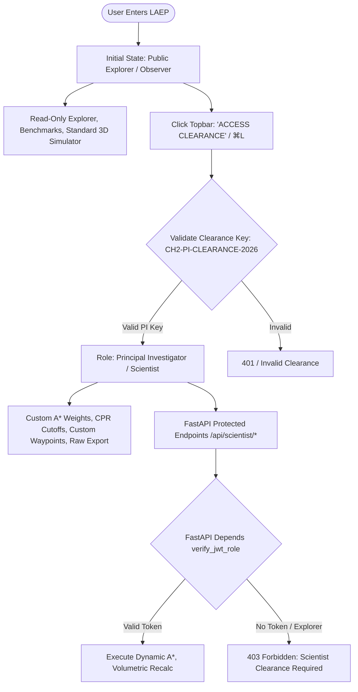

# LAEP Mission Platform: Next-Generation Implementation Plan

## Executive Architectural Summary
This document formalizes the updated engineering and design roadmap for the **LAEP (Lunar Autonomous Exploration & Prospecting)** platform, incorporating user-approved architectural decisions and newly requested capabilities:
1. **Approved Role-Based Mission Authentication**: Implementing the zero-friction **Dual-Tier Clearance Model** (Public Explorer vs. Principal Investigator / Scientist with JWT and Clearance Passphrase `CH2-PI-CLEARANCE-2026`).
2. **NASA Moon Trek Model Bounding Lines & Faustini F2 Reticle**: Adding a dedicated vector layer toggle for the trained model bounds ($80^\circ - 90^\circ\text{S}$, $80^\circ - 90^\circ\text{N}$) and highlighting the active Faustini F2 data region ($-86.5^\circ$ to $-89.9^\circ\text{S}$, $65^\circ$ to $95^\circ\text{E}$).
3. **Bottom High-Width Elevation Shelf**: Elevating the map canvas so the extreme southern polar reach ($-80^\circ$ to $-90^\circ\text{S}$) is completely visible and fit-to-screen without manual zooming.
4. **"Ask Gemini" AI Assistant Sidebar**: Implementing a floating bottom-right action button that toggles a slide-out Chrome-style Gemini sidebar, integrated via `laep-web/.env` (`VITE_GEMINI_API_KEY`) and grounded in LAEP planetary science.
5. **Next-Generation Scientific Instruments**: Radargram 2D profiler, Solar grazing raytracer, Hyperspectral curve inspector, Artemis/VIPER overlay, and Rover inclinometer gauges.

---

## 1. Authentication & Role-Based Access Control (RBAC)

### 1.1 Selected Architecture: Dual-Tier Clearance Model
Per user confirmation, we proceed with **Option B (Dual-Tier Clearance Key with JWT)**:
* **Public Explorer (Default / Normal User)**:
  - Zero login barrier; instant read-only exploration of all benchmark craters (Faustini, Shackleton, Shoemaker), precomputed LOLA/TMC-2 DEMs, ice probability layers, and standard A* routes.
  - Guarantees fast, safe access for evaluators, students, and general users without server calculation spikes.
* **Mission Scientist / Principal Investigator (PI Clearance)**:
  - Unlocked via topbar `[ ACCESS CLEARANCE ]` badge or `⌘L` shortcut entering `CH2-PI-CLEARANCE-2026`.
  - Generates an HMAC-signed JWT stored in browser `sessionStorage`.
  - Dynamically activates **"Investigator Parameter Override Panels"**:
    * Custom Kinematic A* weights (slope penalty $\alpha$, roughness $\beta$, ice attraction $\gamma$, max tilt limit).
    * Dynamic Ice Confidence threshold sliders (CPR cutoff, BD2000 absorption depth sensitivity).
    * Custom waypoint placement and arbitrary bounding-box ROI queries.
    * Export full telemetry packages (GeoJSON, GeoTIFF masks, CSV logs, Python script bundles).



---

## 2. NASA Moon Trek Map Enhancements: Bounding Lines & Elevation Shelf

### 2.1 Model Training Bounds & Faustini F2 Line Reticle
* **Problem**: The deep learning models and current pipeline are trained specifically on the polar regions ($80^\circ - 90^\circ\text{S}$ and $80^\circ - 90^\circ\text{N}$), with active multi-sensor ground truth (DFSAR + IIRS + OHRC) currently anchored to the **Faustini F2** track. Users need clear visual boundaries to know where input coordinates are valid.
* **Solution**:
  - Add a dedicated OpenLayers Vector Layer `LAYER_IDS.BOUNDS = 'bounds'` with an active toggle in `LayerMixer.jsx`.
  - **Feature 1 (South Polar Trained Domain $80^\circ - 90^\circ\text{S}$)**: Cyan dashed boundary across latitude $-80^\circ\text{S}$ with corner telemetry badges: `"TRAINED MODEL ZONE: 80°S – 90°S"`.
  - **Feature 2 (North Polar Domain $80^\circ - 90^\circ\text{N}$)**: Subtle dashed boundary across $+80^\circ\text{N}$ marking the arctic training domain.
  - **Feature 3 (Faustini F2 Active Benchmark Footprint)**: Glowing amber tactical box around `[65.0°E, -89.9°S, 95.0°E, -86.5°S]` with corner reticles and badge: `"FAUSTINI F2 ACTIVE CH-2 RADAR & SPECTRAL DATASET"`.
  - **Default**: Visible on initial load so the user is immediately oriented, with instant 1-click toggle off in the Layer Mixer.

### 2.2 Bottom High-Width Elevation Shelf Bar (Full South Polar Visibility)
* **Problem**: In cylindrical projection (`EPSG:4326`), $-90^\circ\text{S}$ is at the bottom boundary. Bottom HUD overlays (`.map-mode-pill`, `.ol-zoom`, `.ol-attribution`, and compass HUD) obscure the extreme southern craters unless manually zoomed in.
* **Solution**:
  - Add a bottom high-width **Aerospace Elevation Shelf** (`.map-bottom-shelf`, height: `48px`) beneath the map canvas:
    * Displays active MCMF grid status: `"MCMF POLAR GRID ELEVATION SHELF // SOUTH POLAR COVERAGE: -80°00'S TO -90°00'S"`.
    * Physically lifts the OpenLayers canvas above the screen bottom.
  - Configure OpenLayers `View` padding: `padding: [30, 20, 80, 20]`, telling the renderer to preserve an 80px bottom safety zone.
  - Center default view at `[75, -86.8]` (Faustini focus) at `zoom: 4.5`, ensuring the entire $80^\circ\text{S} - 90^\circ\text{S}$ polar circle fits cleanly on screen.
  - Add a `[ FOCUS FAUSTINI F2 ]` button in the map toolbar for instant 1-click re-centering.

---

## 3. "Ask Gemini" AI Assistant Sidebar

### 3.1 Design & User Experience
* **Floating Action Button (FAB)**:
  - Positioned at bottom-right (`bottom: 24px`, `right: 24px`, `z-index: 1000`).
  - Luminous aerospace styling: pulsing cyan/ice border, sparkles icon, and `"ASK GEMINI"` label.
  - Accessible from every page via `App.jsx`.
* **Slide-Over Sidebar (Chrome-Style)**:
  - Width: `400px` (or `100vw` on mobile), slide-out transition from right.
  - Header: Gemini badge, model indicator (`gemini-1.5-flash`), live API status badge, and close button (`✕` / `Escape`).
  - **Quick Inquiry Chips**:
    * *"What is Faustini F2?"*
    * *"Why is the model trained on 80°–90°?"*
    * *"What does CPR > 1.0 indicate?"*
    * *"How does A* kinematics calculate rover slope hazards?"*
    * *"What sensors does Chandrayaan-2 use for ice?"*
  - **Dual Mode AI Engine**:
    * **Mode A (Connected)**: When `VITE_GEMINI_API_KEY` is present in `laep-web/.env`, queries Google Gemini API with system instructions grounding it in LAEP mission parameters.
    * **Mode B (Offline Knowledge Fallback)**: If no key is set yet, shows a helpful setup banner (`Add VITE_GEMINI_API_KEY in .env`) and serves instant, scientifically accurate answers from an embedded LAEP knowledge base!

---

## 4. Next-Generation Scientific Features

| Feature | Scientific Domain | Visual / Interactive Implementation |
| :--- | :--- | :--- |
| **1. Subsurface Radar Radargram 2D Profiler** | DFSAR L-Band (24 cm) Subsurface Sounding | Canvas-rendered echogram drawer showing soil-ice layers down to $-5.0\,\text{m}$ depth based on dielectric permittivity $\epsilon_r \approx 2.7 - 3.1$. |
| **2. Real-Time Solar Elevation & Shadow Slider** | Polar Grazing Lighting ($0^\circ - 5^\circ$) | Interactive time-lapse slider dynamically re-orienting Three.js directional sun vectors and calculating real-time crater rim shadows. |
| **3. IIRS 256-Channel Hyperspectral Curve Inspector** | Diagnostic $\text{OH}/\text{H}_2\text{O}$ Absorption | Point-and-click spectrum inspector plotting reflectance $0.8 - 5.0\,\mu\text{m}$ with the continuum-normalized $2.0\,\mu\text{m}$ absorption trough ($\text{BD2000}$). |
| **4. Artemis III & Collaborative Mission GIS Overlay** | NASA Artemis III & VIPER Traversal | Layer toggles for 13 Artemis III candidate landing zones and VIPER routes over Chandrayaan-2 DFSAR polar tracks. |
| **5. Rover Kinematic Physics & Inclinometer HUD** | Wheeled Traversal Safety | Aerospace circular gyro HUD in the 3D Simulator displaying pitch/roll tilt, $>15^\circ$ scarp warning alarms, wheel slip ratio, and solar panel power budget. |
| **6. Deep Space Network (DSN) Latency Tracker** | Lunar Comms Telemetry | Topbar telemetry badge tracking live link to ISRO ISTRAC Byalalu 32m DSN Antenna, 1.282s One-Way Light Time (OWLT), and carrier SNR. |

---

## 5. Execution Sequence

```mermaid
graph TD
    subgraph Step 1: NASA Moon Trek Fixes
        S1A[1.1 Add LAYER_IDS.BOUNDS in useMissionStore.js]
        S1B[1.2 Add 80°-90° & Faustini F2 Vector Layer in MoonMap.jsx]
        S1C[1.3 Add Bottom Elevation Shelf & View Padding in MoonMap & map.css]
        S1D[1.4 Add Bounds Toggle in LayerMixer.jsx]
        S1A --> S1B --> S1C --> S1D
    end

    subgraph Step 2: Ask Gemini AI Assistant
        S2A[2.1 Create laep-web/.env & update .env.example]
        S2B[2.2 Build GeminiAssistant.jsx Drawer & System Prompt]
        S2C[2.3 Add Bottom-Right Floating Trigger Button in App.jsx]
        S2A --> S2B --> S2C
    end

    subgraph Step 3: Role-Based Authentication
        S3A[3.1 Backend auth.py with JWT & Clearance Key]
        S3B[3.2 Frontend userRole state & MissionClearanceModal.jsx]
        S3C[3.3 Topbar Clearance Badge & Scientist Input Overrides]
        S3A --> S3B --> S3C
    end

    subgraph Step 4: Next-Gen Scientific Features
        S4A[4.1 Subsurface Radargram 2D Profiler]
        S4B[4.2 Solar Horizon Slider & Raytracer]
        S4C[4.3 IIRS Hyperspectral Curve Inspector]
        S4D[4.4 Artemis III Collaborative GIS Overlay]
        S4E[4.5 Rover Inclinometer & DSN Latency Badge]
        S4A --> S4B --> S4C --> S4D --> S4E
    end

    Step 1 --> Step 2 --> Step 3 --> Step 4
```
